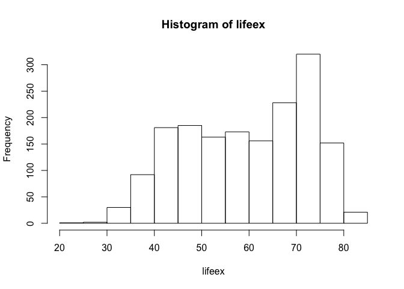
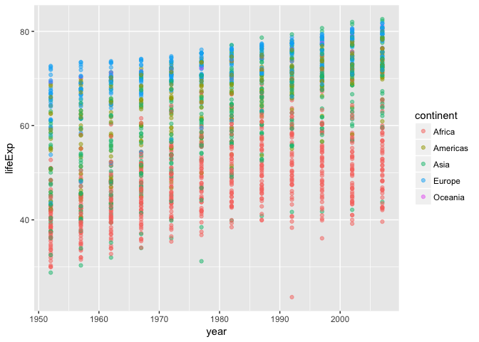
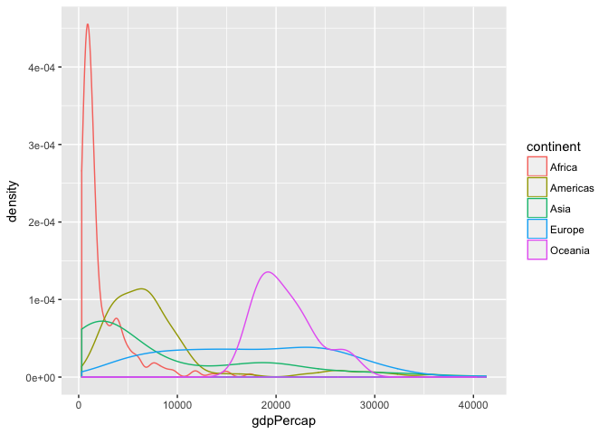
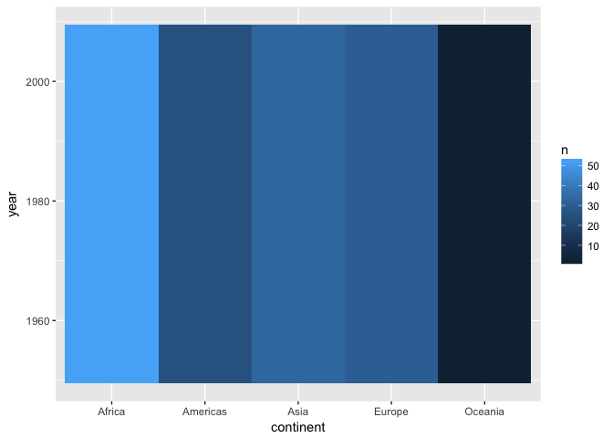
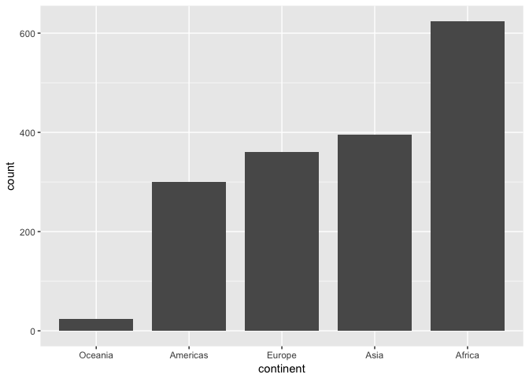

# hw 02
Xinzhe Dong  
September 22, 2017  
## 1. load the packages

```r
library(gapminder)
library(tidyverse)
```

```
## Loading tidyverse: ggplot2
## Loading tidyverse: tibble
## Loading tidyverse: tidyr
## Loading tidyverse: readr
## Loading tidyverse: purrr
## Loading tidyverse: dplyr
```

```
## Conflicts with tidy packages ----------------------------------------------
```

```
## filter(): dplyr, stats
## lag():    dplyr, stats
```

```r
library(knitr)
library(kableExtra)
library(ggplot2)
library(forcats)
```


## 2. Explore the gapminder object:

```r
gapminder
```

```
## # A tibble: 1,704 x 6
##        country continent  year lifeExp      pop gdpPercap
##         <fctr>    <fctr> <int>   <dbl>    <int>     <dbl>
##  1 Afghanistan      Asia  1952  28.801  8425333  779.4453
##  2 Afghanistan      Asia  1957  30.332  9240934  820.8530
##  3 Afghanistan      Asia  1962  31.997 10267083  853.1007
##  4 Afghanistan      Asia  1967  34.020 11537966  836.1971
##  5 Afghanistan      Asia  1972  36.088 13079460  739.9811
##  6 Afghanistan      Asia  1977  38.438 14880372  786.1134
##  7 Afghanistan      Asia  1982  39.854 12881816  978.0114
##  8 Afghanistan      Asia  1987  40.822 13867957  852.3959
##  9 Afghanistan      Asia  1992  41.674 16317921  649.3414
## 10 Afghanistan      Asia  1997  41.763 22227415  635.3414
## # ... with 1,694 more rows
```

```r
str(gapminder)
```

```
## Classes 'tbl_df', 'tbl' and 'data.frame':	1704 obs. of  6 variables:
##  $ country  : Factor w/ 142 levels "Afghanistan",..: 1 1 1 1 1 1 1 1 1 1 ...
##  $ continent: Factor w/ 5 levels "Africa","Americas",..: 3 3 3 3 3 3 3 3 3 3 ...
##  $ year     : int  1952 1957 1962 1967 1972 1977 1982 1987 1992 1997 ...
##  $ lifeExp  : num  28.8 30.3 32 34 36.1 ...
##  $ pop      : int  8425333 9240934 10267083 11537966 13079460 14880372 12881816 13867957 16317921 22227415 ...
##  $ gdpPercap: num  779 821 853 836 740 ...
```

```r
ncol(gapminder)
```

```
## [1] 6
```

```r
nrow(gapminder)
```

```
## [1] 1704
```

```r
length(gapminder)
```

```
## [1] 6
```

```r
dim(gapminder)
```

```
## [1] 1704    6
```

```r
names(gapminder)
```

```
## [1] "country"   "continent" "year"      "lifeExp"   "pop"       "gdpPercap"
```

* It is a data.frame.
* Classes ‘tbl_df’, ‘tbl’ and 'data.frame'
* There are 6 variables/columns.
* There are 1704 rows/obs.
* I can use str(), ncol(), nrow(), length(), dim(), names() to get facts about “extent” or “size”. 
    + The function str() displays the dimension of the data frame, the datatype for each    variable, (abbreviated) contents of the variables. It gives us a basic understanding of the data frame.
    + The functions ncol(), nrow(), length(), dim() and names() return much simpler results, they are useful if we just need the information about dimension of the dataset. The functions ncol(), nrow(), length(), dim() return the number of rows or columns in the dataframe; the function names() return the names of the variables. 
* Country is factor, continent is factor, year is integer, lifeExp is number, pop is integer, gdpPercap is num.


## 3. Explore individual variables
#### (1) explore the categorical variable "continent"

```r
cont <- gapminder$continent
class(cont)
```

```
## [1] "factor"
```

```r
summary(cont)
```

```
##   Africa Americas     Asia   Europe  Oceania 
##      624      300      396      360       24
```

```r
levels(cont)
```

```
## [1] "Africa"   "Americas" "Asia"     "Europe"   "Oceania"
```

```r
nlevels(cont)
```

```
## [1] 5
```

```r
plot(cont)
```

<!-- -->
* This categorical variable has 5 levels.
* The possible values for continent are: "Africa", "Americas", "Asia", "Europe", "Oceania".
* Among the five levels, "Africa" has the largest number of observations, and "Oceania" has the smallest number of observations.

#### (2) explore the quantitative variable "lifeExp"

```r
lifeex <- gapminder$lifeExp
summary(lifeex)
```

```
##    Min. 1st Qu.  Median    Mean 3rd Qu.    Max. 
##   23.60   48.20   60.71   59.47   70.85   82.60
```

```r
max(summary(lifeex))-min(summary(lifeex))
```

```
## [1] 59
```

```r
boxplot(lifeex)
```

<!-- -->

```r
hist(lifeex)
```

<!-- -->
* The five-number summary for "lifeExp" is: 23.60(Min), 48.20(1st Qu.), 60.71(Median),    70.85(3rd Qu.), 82.60(Max).
* The range is 59.
* The histogram of "lifeExp" is left-skewed. The interval 70-75 contains the most observations.

## 4. Explore various plot types
#### A scatterplot of year vs. lifeExp.

```r
ggplot(gapminder, aes(x=year, y=lifeExp)) +
    geom_point(aes(color=continent),alpha=0.5)
```

<!-- -->

#### A density plot of lifeExp

```r
ggplot(gapminder, aes(x = lifeExp, color = continent)) + geom_density()
```

<!-- -->

#### A boxplot of lifeExp and continents

```r
ggplot(gapminder, aes(x = continent, y = lifeExp, color=continent)) + geom_boxplot()
```

<!-- -->


## 5. Use filter(), select() and %>%

#### Use filter() to create data subsets of all entries occuring from 1980 to 1999.

```r
subdata <- filter(gapminder, year <= 1999, year >= 1980)
```

#### Practice piping together filter(), select() and ggplot().
##### a density plot of gdpPercap

```r
subdata%>%
 select(continent, gdpPercap)%>%
  ggplot(aes(x=gdpPercap,color=continent)) +
    geom_density()
```

<!-- -->


## 6. I want to do more!
#### Evaluate this code and describe the result.

```r
filter(gapminder, country == c("Rwanda", "Afghanistan"))
```

```
## # A tibble: 12 x 6
##        country continent  year lifeExp      pop gdpPercap
##         <fctr>    <fctr> <int>   <dbl>    <int>     <dbl>
##  1 Afghanistan      Asia  1957  30.332  9240934  820.8530
##  2 Afghanistan      Asia  1967  34.020 11537966  836.1971
##  3 Afghanistan      Asia  1977  38.438 14880372  786.1134
##  4 Afghanistan      Asia  1987  40.822 13867957  852.3959
##  5 Afghanistan      Asia  1997  41.763 22227415  635.3414
##  6 Afghanistan      Asia  2007  43.828 31889923  974.5803
##  7      Rwanda    Africa  1952  40.000  2534927  493.3239
##  8      Rwanda    Africa  1962  43.000  3051242  597.4731
##  9      Rwanda    Africa  1972  44.600  3992121  590.5807
## 10      Rwanda    Africa  1982  46.218  5507565  881.5706
## 11      Rwanda    Africa  1992  23.599  7290203  737.0686
## 12      Rwanda    Africa  2002  43.413  7852401  785.6538
```
The analyst did not succeed, this only gives part of the data.

The followings are correct ways to do this.

```r
filter(gapminder, (country=="Rwanda"|country=="Afghanistan"))
```

```
## # A tibble: 24 x 6
##        country continent  year lifeExp      pop gdpPercap
##         <fctr>    <fctr> <int>   <dbl>    <int>     <dbl>
##  1 Afghanistan      Asia  1952  28.801  8425333  779.4453
##  2 Afghanistan      Asia  1957  30.332  9240934  820.8530
##  3 Afghanistan      Asia  1962  31.997 10267083  853.1007
##  4 Afghanistan      Asia  1967  34.020 11537966  836.1971
##  5 Afghanistan      Asia  1972  36.088 13079460  739.9811
##  6 Afghanistan      Asia  1977  38.438 14880372  786.1134
##  7 Afghanistan      Asia  1982  39.854 12881816  978.0114
##  8 Afghanistan      Asia  1987  40.822 13867957  852.3959
##  9 Afghanistan      Asia  1992  41.674 16317921  649.3414
## 10 Afghanistan      Asia  1997  41.763 22227415  635.3414
## # ... with 14 more rows
```

```r
filter(gapminder, country %in% c("Rwanda", "Afghanistan"))
```

```
## # A tibble: 24 x 6
##        country continent  year lifeExp      pop gdpPercap
##         <fctr>    <fctr> <int>   <dbl>    <int>     <dbl>
##  1 Afghanistan      Asia  1952  28.801  8425333  779.4453
##  2 Afghanistan      Asia  1957  30.332  9240934  820.8530
##  3 Afghanistan      Asia  1962  31.997 10267083  853.1007
##  4 Afghanistan      Asia  1967  34.020 11537966  836.1971
##  5 Afghanistan      Asia  1972  36.088 13079460  739.9811
##  6 Afghanistan      Asia  1977  38.438 14880372  786.1134
##  7 Afghanistan      Asia  1982  39.854 12881816  978.0114
##  8 Afghanistan      Asia  1987  40.822 13867957  852.3959
##  9 Afghanistan      Asia  1992  41.674 16317921  649.3414
## 10 Afghanistan      Asia  1997  41.763 22227415  635.3414
## # ... with 14 more rows
```

#### Present numerical tables in a more attractive form
##### A table of entries of Australia

```r
gapminder%>%
    filter(country == "Australia")%>%
    kable("html",caption="Entries of Australia")%>%
    kable_styling(bootstrap_options = c("striped", "hover", "condensed", "responsive"))
```

<table class="table table-striped table-hover table-condensed table-responsive" style="margin-left: auto; margin-right: auto;">
<caption>Entries of Australia</caption>
 <thead><tr>
<th style="text-align:left;"> country </th>
   <th style="text-align:left;"> continent </th>
   <th style="text-align:right;"> year </th>
   <th style="text-align:right;"> lifeExp </th>
   <th style="text-align:right;"> pop </th>
   <th style="text-align:right;"> gdpPercap </th>
  </tr></thead>
<tbody>
<tr>
<td style="text-align:left;"> Australia </td>
   <td style="text-align:left;"> Oceania </td>
   <td style="text-align:right;"> 1952 </td>
   <td style="text-align:right;"> 69.120 </td>
   <td style="text-align:right;"> 8691212 </td>
   <td style="text-align:right;"> 10039.60 </td>
  </tr>
<tr>
<td style="text-align:left;"> Australia </td>
   <td style="text-align:left;"> Oceania </td>
   <td style="text-align:right;"> 1957 </td>
   <td style="text-align:right;"> 70.330 </td>
   <td style="text-align:right;"> 9712569 </td>
   <td style="text-align:right;"> 10949.65 </td>
  </tr>
<tr>
<td style="text-align:left;"> Australia </td>
   <td style="text-align:left;"> Oceania </td>
   <td style="text-align:right;"> 1962 </td>
   <td style="text-align:right;"> 70.930 </td>
   <td style="text-align:right;"> 10794968 </td>
   <td style="text-align:right;"> 12217.23 </td>
  </tr>
<tr>
<td style="text-align:left;"> Australia </td>
   <td style="text-align:left;"> Oceania </td>
   <td style="text-align:right;"> 1967 </td>
   <td style="text-align:right;"> 71.100 </td>
   <td style="text-align:right;"> 11872264 </td>
   <td style="text-align:right;"> 14526.12 </td>
  </tr>
<tr>
<td style="text-align:left;"> Australia </td>
   <td style="text-align:left;"> Oceania </td>
   <td style="text-align:right;"> 1972 </td>
   <td style="text-align:right;"> 71.930 </td>
   <td style="text-align:right;"> 13177000 </td>
   <td style="text-align:right;"> 16788.63 </td>
  </tr>
<tr>
<td style="text-align:left;"> Australia </td>
   <td style="text-align:left;"> Oceania </td>
   <td style="text-align:right;"> 1977 </td>
   <td style="text-align:right;"> 73.490 </td>
   <td style="text-align:right;"> 14074100 </td>
   <td style="text-align:right;"> 18334.20 </td>
  </tr>
<tr>
<td style="text-align:left;"> Australia </td>
   <td style="text-align:left;"> Oceania </td>
   <td style="text-align:right;"> 1982 </td>
   <td style="text-align:right;"> 74.740 </td>
   <td style="text-align:right;"> 15184200 </td>
   <td style="text-align:right;"> 19477.01 </td>
  </tr>
<tr>
<td style="text-align:left;"> Australia </td>
   <td style="text-align:left;"> Oceania </td>
   <td style="text-align:right;"> 1987 </td>
   <td style="text-align:right;"> 76.320 </td>
   <td style="text-align:right;"> 16257249 </td>
   <td style="text-align:right;"> 21888.89 </td>
  </tr>
<tr>
<td style="text-align:left;"> Australia </td>
   <td style="text-align:left;"> Oceania </td>
   <td style="text-align:right;"> 1992 </td>
   <td style="text-align:right;"> 77.560 </td>
   <td style="text-align:right;"> 17481977 </td>
   <td style="text-align:right;"> 23424.77 </td>
  </tr>
<tr>
<td style="text-align:left;"> Australia </td>
   <td style="text-align:left;"> Oceania </td>
   <td style="text-align:right;"> 1997 </td>
   <td style="text-align:right;"> 78.830 </td>
   <td style="text-align:right;"> 18565243 </td>
   <td style="text-align:right;"> 26997.94 </td>
  </tr>
<tr>
<td style="text-align:left;"> Australia </td>
   <td style="text-align:left;"> Oceania </td>
   <td style="text-align:right;"> 2002 </td>
   <td style="text-align:right;"> 80.370 </td>
   <td style="text-align:right;"> 19546792 </td>
   <td style="text-align:right;"> 30687.75 </td>
  </tr>
<tr>
<td style="text-align:left;"> Australia </td>
   <td style="text-align:left;"> Oceania </td>
   <td style="text-align:right;"> 2007 </td>
   <td style="text-align:right;"> 81.235 </td>
   <td style="text-align:right;"> 20434176 </td>
   <td style="text-align:right;"> 34435.37 </td>
  </tr>
</tbody>
</table>

#### Use more of the dplyr functions for operating on a single table.
##### 1. Use arrange() to order the data frame by year, then descending by population.

```r
arrange(gapminder, year,desc(pop))
```

```
## # A tibble: 1,704 x 6
##           country continent  year lifeExp       pop  gdpPercap
##            <fctr>    <fctr> <int>   <dbl>     <int>      <dbl>
##  1          China      Asia  1952  44.000 556263527   400.4486
##  2          India      Asia  1952  37.373 372000000   546.5657
##  3  United States  Americas  1952  68.440 157553000 13990.4821
##  4          Japan      Asia  1952  63.030  86459025  3216.9563
##  5      Indonesia      Asia  1952  37.468  82052000   749.6817
##  6        Germany    Europe  1952  67.500  69145952  7144.1144
##  7         Brazil  Americas  1952  50.917  56602560  2108.9444
##  8 United Kingdom    Europe  1952  69.180  50430000  9979.5085
##  9          Italy    Europe  1952  65.940  47666000  4931.4042
## 10     Bangladesh      Asia  1952  37.484  46886859   684.2442
## # ... with 1,694 more rows
```

##### 2. Use mutate() to get GDP by multiplying GPD per capita with population.

```r
mutate(gapminder, gdp = gdpPercap * pop)
```

```
## # A tibble: 1,704 x 7
##        country continent  year lifeExp      pop gdpPercap         gdp
##         <fctr>    <fctr> <int>   <dbl>    <int>     <dbl>       <dbl>
##  1 Afghanistan      Asia  1952  28.801  8425333  779.4453  6567086330
##  2 Afghanistan      Asia  1957  30.332  9240934  820.8530  7585448670
##  3 Afghanistan      Asia  1962  31.997 10267083  853.1007  8758855797
##  4 Afghanistan      Asia  1967  34.020 11537966  836.1971  9648014150
##  5 Afghanistan      Asia  1972  36.088 13079460  739.9811  9678553274
##  6 Afghanistan      Asia  1977  38.438 14880372  786.1134 11697659231
##  7 Afghanistan      Asia  1982  39.854 12881816  978.0114 12598563401
##  8 Afghanistan      Asia  1987  40.822 13867957  852.3959 11820990309
##  9 Afghanistan      Asia  1992  41.674 16317921  649.3414 10595901589
## 10 Afghanistan      Asia  1997  41.763 22227415  635.3414 14121995875
## # ... with 1,694 more rows
```

##### 3. Get a statistical summary of gdp for each continent using mutate(), group_by(), and summarize(). 

```r
gapminder %>% 
  mutate(gdp = gdpPercap * pop) %>%
  group_by(continent) %>% 
    summarize(mean_gdp=mean(gdp), sd_gdp=sd(gdp))
```

```
## # A tibble: 5 x 3
##   continent     mean_gdp       sd_gdp
##      <fctr>        <dbl>        <dbl>
## 1    Africa  20904782844 5.025490e+10
## 2  Americas 379262350210 1.427430e+12
## 3      Asia 227233738153 6.283144e+11
## 4    Europe 269442085301 4.392267e+11
## 5   Oceania 188187105354 1.938612e+11
```

#### Adapt exercises from the chapters in the “Explore” section of R for Data Science to the Gapminder dataset.
A plot for two categorical variables. (We regard the "year" variable as categorical here)

```r
gapminder %>% 
  count(continent, year) %>%  
  ggplot(mapping = aes(x = continent, y = year)) +
    geom_tile(mapping = aes(fill = n))
```

<!-- -->

We can tell from this plot that:

* Each continent has different number of count(observations). 
* Africa has the largest number of observations, and Oceania has the least number of observations. 
* The count does not vary with the year. 


For bar plots, we can use fct_infreq() to order levels in increasing frequency. Let's try it with the factor "continent".

```r
gapminder %>%
  mutate(continent = continent %>% fct_infreq() %>% fct_rev()) %>%
  ggplot(aes(continent)) +
    geom_bar(width = 0.8)
```

<!-- -->


We can try facet the plot by a single categorial variable, using facet_wrap(), then we can get subplots that each display one subset of the data. Let's try it with "continent" to get a plot of lifeex vs. year for each continent.

```r
ggplot(data = gapminder) + 
  geom_point(mapping = aes(x = year, y = lifeex)) + 
  facet_wrap(~ continent, nrow = 2)
```

<!-- -->

