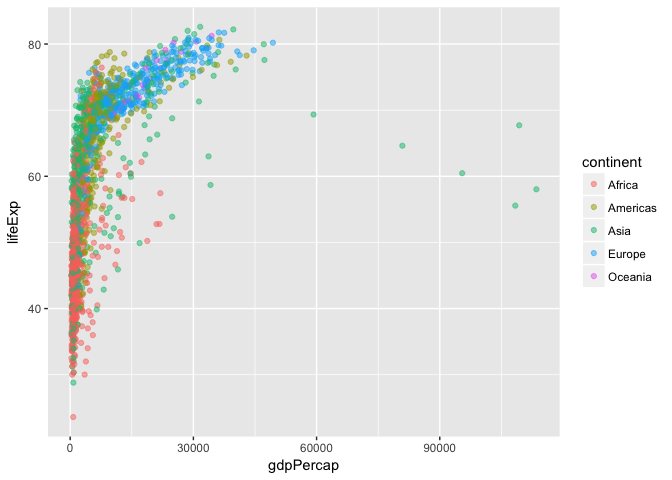
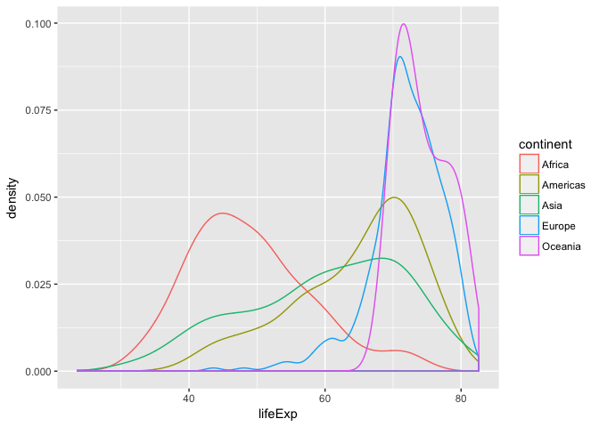

# hw 02
Xinzhe Dong  
September 22, 2017  


```r
library(gapminder)
library(tidyverse)
```

```
## Loading tidyverse: ggplot2
## Loading tidyverse: tibble
## Loading tidyverse: tidyr
## Loading tidyverse: readr
## Loading tidyverse: purrr
## Loading tidyverse: dplyr
```

```
## Conflicts with tidy packages ----------------------------------------------
```

```
## filter(): dplyr, stats
## lag():    dplyr, stats
```

```r
library(knitr)
library(kableExtra)

gapminder
```

```
## # A tibble: 1,704 x 6
##        country continent  year lifeExp      pop gdpPercap
##         <fctr>    <fctr> <int>   <dbl>    <int>     <dbl>
##  1 Afghanistan      Asia  1952  28.801  8425333  779.4453
##  2 Afghanistan      Asia  1957  30.332  9240934  820.8530
##  3 Afghanistan      Asia  1962  31.997 10267083  853.1007
##  4 Afghanistan      Asia  1967  34.020 11537966  836.1971
##  5 Afghanistan      Asia  1972  36.088 13079460  739.9811
##  6 Afghanistan      Asia  1977  38.438 14880372  786.1134
##  7 Afghanistan      Asia  1982  39.854 12881816  978.0114
##  8 Afghanistan      Asia  1987  40.822 13867957  852.3959
##  9 Afghanistan      Asia  1992  41.674 16317921  649.3414
## 10 Afghanistan      Asia  1997  41.763 22227415  635.3414
## # ... with 1,694 more rows
```

```r
str(gapminder)
```

```
## Classes 'tbl_df', 'tbl' and 'data.frame':	1704 obs. of  6 variables:
##  $ country  : Factor w/ 142 levels "Afghanistan",..: 1 1 1 1 1 1 1 1 1 1 ...
##  $ continent: Factor w/ 5 levels "Africa","Americas",..: 3 3 3 3 3 3 3 3 3 3 ...
##  $ year     : int  1952 1957 1962 1967 1972 1977 1982 1987 1992 1997 ...
##  $ lifeExp  : num  28.8 30.3 32 34 36.1 ...
##  $ pop      : int  8425333 9240934 10267083 11537966 13079460 14880372 12881816 13867957 16317921 22227415 ...
##  $ gdpPercap: num  779 821 853 836 740 ...
```
1. It is a data.frame.
2. Classes ‘tbl_df’, ‘tbl’ and 'data.frame'
3. 6 variables/columns
4. 1704 rows/obs.
5. I can use str(), ncol(), nrow(), length(), dim(), names().
6. Country is factor, continent is factor, year is integer, lifeExp is number, pop is integer, gdpPercap is num.


```r
cont <- gapminder$continent
class(cont)
```

```
## [1] "factor"
```

```r
summary(cont)
```

```
##   Africa Americas     Asia   Europe  Oceania 
##      624      300      396      360       24
```

```r
levels(cont)
```

```
## [1] "Africa"   "Americas" "Asia"     "Europe"   "Oceania"
```

```r
nlevels(cont)
```

```
## [1] 5
```

```r
lifeex <- gapminder$lifeExp
summary(lifeex)
```

```
##    Min. 1st Qu.  Median    Mean 3rd Qu.    Max. 
##   23.60   48.20   60.71   59.47   70.85   82.60
```

Let’s try to make a basic scatterplot of year vs. lifeExp.

```r
ggplot(gapminder, aes(x=year, y=lifeExp)) +
    geom_point()
```

<!-- -->

histogram of lifeExp

```r
ggplot(gapminder, aes(x = lifeExp)) +
  geom_histogram()
```

```
## `stat_bin()` using `bins = 30`. Pick better value with `binwidth`.
```

<!-- -->

A boxplot of lifeExp and one continents

```r
ggplot(gapminder, aes(x = continent, y = lifeExp)) + geom_boxplot()
```

<!-- -->

Use filter() to create data subsets that you want to plot.

```r
filter(gapminder, year <= 1999, year >= 1960)
```

```
## # A tibble: 1,136 x 6
##        country continent  year lifeExp      pop gdpPercap
##         <fctr>    <fctr> <int>   <dbl>    <int>     <dbl>
##  1 Afghanistan      Asia  1962  31.997 10267083  853.1007
##  2 Afghanistan      Asia  1967  34.020 11537966  836.1971
##  3 Afghanistan      Asia  1972  36.088 13079460  739.9811
##  4 Afghanistan      Asia  1977  38.438 14880372  786.1134
##  5 Afghanistan      Asia  1982  39.854 12881816  978.0114
##  6 Afghanistan      Asia  1987  40.822 13867957  852.3959
##  7 Afghanistan      Asia  1992  41.674 16317921  649.3414
##  8 Afghanistan      Asia  1997  41.763 22227415  635.3414
##  9     Albania    Europe  1962  64.820  1728137 2312.8890
## 10     Albania    Europe  1967  66.220  1984060 2760.1969
## # ... with 1,126 more rows
```

Practice piping together filter() and select(). Possibly even piping into ggplot().

```r
gapminder%>%
 select(year, lifeExp)%>%
filter(year <= 1999, year >= 1960)%>%
  ggplot(aes(x=year, y=lifeExp)) +
    geom_point()
```

<!-- -->

This only gives part of the data.

```r
filter(gapminder, country == c("Rwanda", "Afghanistan"))
```

```
## # A tibble: 12 x 6
##        country continent  year lifeExp      pop gdpPercap
##         <fctr>    <fctr> <int>   <dbl>    <int>     <dbl>
##  1 Afghanistan      Asia  1957  30.332  9240934  820.8530
##  2 Afghanistan      Asia  1967  34.020 11537966  836.1971
##  3 Afghanistan      Asia  1977  38.438 14880372  786.1134
##  4 Afghanistan      Asia  1987  40.822 13867957  852.3959
##  5 Afghanistan      Asia  1997  41.763 22227415  635.3414
##  6 Afghanistan      Asia  2007  43.828 31889923  974.5803
##  7      Rwanda    Africa  1952  40.000  2534927  493.3239
##  8      Rwanda    Africa  1962  43.000  3051242  597.4731
##  9      Rwanda    Africa  1972  44.600  3992121  590.5807
## 10      Rwanda    Africa  1982  46.218  5507565  881.5706
## 11      Rwanda    Africa  1992  23.599  7290203  737.0686
## 12      Rwanda    Africa  2002  43.413  7852401  785.6538
```


```r
filter(gapminder, (country=="Rwanda"|country=="Afghanistan"))
```

```
## # A tibble: 24 x 6
##        country continent  year lifeExp      pop gdpPercap
##         <fctr>    <fctr> <int>   <dbl>    <int>     <dbl>
##  1 Afghanistan      Asia  1952  28.801  8425333  779.4453
##  2 Afghanistan      Asia  1957  30.332  9240934  820.8530
##  3 Afghanistan      Asia  1962  31.997 10267083  853.1007
##  4 Afghanistan      Asia  1967  34.020 11537966  836.1971
##  5 Afghanistan      Asia  1972  36.088 13079460  739.9811
##  6 Afghanistan      Asia  1977  38.438 14880372  786.1134
##  7 Afghanistan      Asia  1982  39.854 12881816  978.0114
##  8 Afghanistan      Asia  1987  40.822 13867957  852.3959
##  9 Afghanistan      Asia  1992  41.674 16317921  649.3414
## 10 Afghanistan      Asia  1997  41.763 22227415  635.3414
## # ... with 14 more rows
```


```r
filter(gapminder, country %in% c("Rwanda", "Afghanistan"))
```

```
## # A tibble: 24 x 6
##        country continent  year lifeExp      pop gdpPercap
##         <fctr>    <fctr> <int>   <dbl>    <int>     <dbl>
##  1 Afghanistan      Asia  1952  28.801  8425333  779.4453
##  2 Afghanistan      Asia  1957  30.332  9240934  820.8530
##  3 Afghanistan      Asia  1962  31.997 10267083  853.1007
##  4 Afghanistan      Asia  1967  34.020 11537966  836.1971
##  5 Afghanistan      Asia  1972  36.088 13079460  739.9811
##  6 Afghanistan      Asia  1977  38.438 14880372  786.1134
##  7 Afghanistan      Asia  1982  39.854 12881816  978.0114
##  8 Afghanistan      Asia  1987  40.822 13867957  852.3959
##  9 Afghanistan      Asia  1992  41.674 16317921  649.3414
## 10 Afghanistan      Asia  1997  41.763 22227415  635.3414
## # ... with 14 more rows
```


```r
gapminder%>%
    filter(country == "Australia")%>%
  knitr::kable()
```


country     continent    year   lifeExp        pop   gdpPercap
----------  ----------  -----  --------  ---------  ----------
Australia   Oceania      1952    69.120    8691212    10039.60
Australia   Oceania      1957    70.330    9712569    10949.65
Australia   Oceania      1962    70.930   10794968    12217.23
Australia   Oceania      1967    71.100   11872264    14526.12
Australia   Oceania      1972    71.930   13177000    16788.63
Australia   Oceania      1977    73.490   14074100    18334.20
Australia   Oceania      1982    74.740   15184200    19477.01
Australia   Oceania      1987    76.320   16257249    21888.89
Australia   Oceania      1992    77.560   17481977    23424.77
Australia   Oceania      1997    78.830   18565243    26997.94
Australia   Oceania      2002    80.370   19546792    30687.75
Australia   Oceania      2007    81.235   20434176    34435.37
