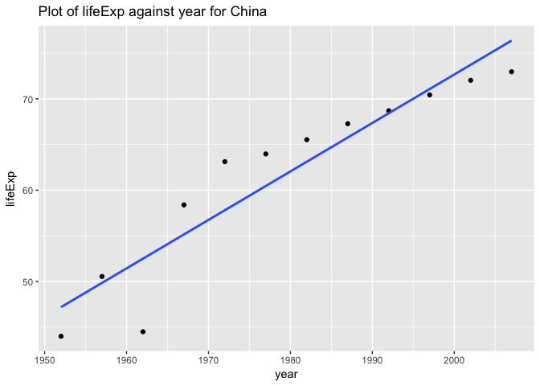
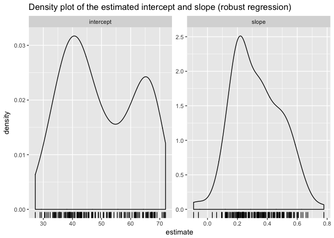
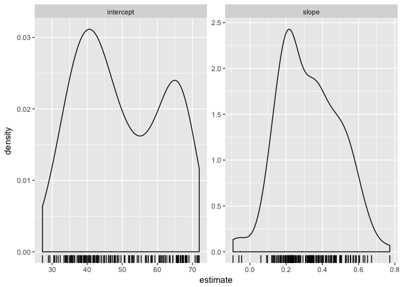
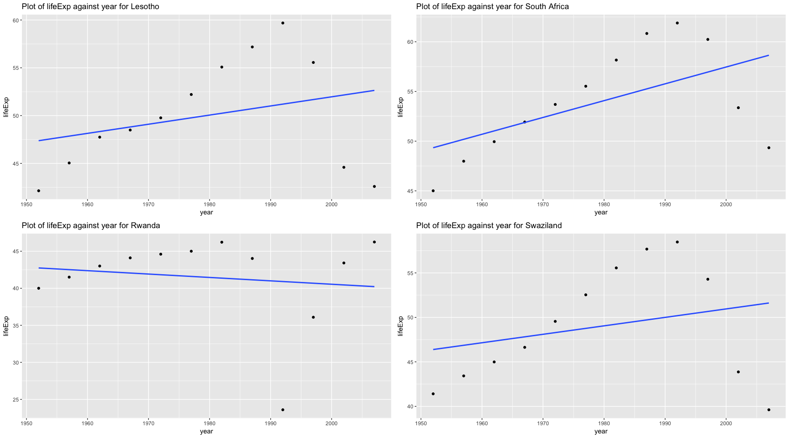

hw 06
================
Xinzhe Dong
November 2, 2017

### Abstract

In this homework, I am going to:

-   Write two functions that do linear regression and robust regression on the Gapminder data, and compare their slopes, intercepts, and estimated mspe.

-   Create a nested data frame and map a linear regression function and a robust regression function over the list column holding the nested data, and get information out of the linear models to make some exploration.

-   Practice some of the exercises from the Strings chapter.

#### Table of content

-   [Load data and packages](#load-data-and-packages)
-   [Writing functions](#writing-functions)
-   [Work with a nested data frame](#work-with-a-nested-data-frame)
-   [Character data](#character-data)

Load data and packages
----------------------

[*Back to the top*](#abstract)

``` r
library(tidyverse)
library(stringr)
library(glue)
library(gapminder)
library(ggplot2)
library(MASS)
library(singer)
library(ggmap)
library(broom)
library(kableExtra)
library(knitr)
library(data.table)
```

Writing functions
-----------------

[*Back to the top*](#abstract)

I will write two functions in this section, `le_lin_fit` and `le_r_fit`. The input and output for both functions are summarized as follow:

-   Input: both function take in a data.frame that contains (at least) a lifeExp variable and a variable for year

-   Output:

    -   `le_lin_fit`: a list of estimated intercept and slope, with the estimated mspe, from a linear regression of lifeExp on year

    -   `le_r_fit`: a list of estimated intercept and slope, with the estimated mspe, from a robust regression of lifeExp on year

**(1)** Get a subset of gapminder so that it only contains entries of China. And plot the lifeExp against year.

``` r
j_country <- "China"
j_dat <- gapminder %>% 
  filter(country == j_country)

p <- ggplot(j_dat, aes(x = year, y = lifeExp))
p + geom_point() + geom_smooth(method = "lm", se = FALSE)
```



From the plot, we can tell that there are two outliers of lifeExp in year 1952 and 1962.

**(2)** Split data into a training set and a test set. (so that we can calculate estimated mspe for the two functions)

``` r
set.seed(123456)
n <- nrow(j_dat)
ii <- sample(n, floor(n/4))
dat.te <- j_dat[ ii, ]
dat.tr <- j_dat[ -ii, ]
```

**(3)** Fit a linear model to the training set. And calculate the estimated mspe on the test set.

``` r
le_lin_fit <- function(dat, offset = 1952) {
  dat$year = dat$year - offset
  # fit a linear regression model
  the_fit <- lm(lifeExp ~ year, dat)
  # predict on the test set
  dat.te$year = dat.te$year - offset
  pr.to <- predict(the_fit, newdata=dat.te)
  # calculate the mspe
  mspe <- with(dat.te, mean((dat.te$lifeExp - pr.to)^2) )
  # return the intercept, slope and the mspe
  return(c("intercept"=the_fit$coefficients[[1]],
              "slope"=the_fit$coefficients[[2]],"mspe"=mspe))
}
le_lin_fit(dat.tr)
```

    ##  intercept      slope       mspe 
    ## 46.4994554  0.5453455  4.7399640

**(4)** Fit a robust regression model to the training set. And calculate the estimated mspe on the test set.

``` r
le_r_fit <- function(dat, offset = 1952) {
  dat$year = dat$year - offset
  # fit a robust regression model
  the_fit <- MASS::rlm(formula = lifeExp ~ year, data=dat)
  # predict on the test set
  dat.te$year = dat.te$year - offset
  pr.to <- predict(the_fit, newdata=dat.te)
  # calculate the mspe
  mspe <- with(dat.te, mean((dat.te$lifeExp - pr.to)^2) )
  # return the intercept, slope and the mspe
    return(c("intercept"=the_fit$coefficients[[1]],
              "slope"=the_fit$coefficients[[2]],"mspe"=mspe))
}

le_r_fit(dat.tr)
```

    ## intercept     slope      mspe 
    ## 46.969012  0.535232  3.980352

**Note:**

-   The two regression functions return slightly different intercepts and slopes.

-   The robust regression model returns a smaller estimated mspe, which means it is more resistent to the existence of outliers.

-   The training set has 9 observations while the test set has 3 observations. Therefore the sample size is relatively small to make concrete conclusions. However, the major point of this task is to recognize that the robust regression model is less likely to be influenced by extreme values.

Work with a nested data frame
-----------------------------

[*Back to the top*](#abstract)

**Abstract**:

-   Create a nested data frame and map a function over the list column holding the nested data.

-   Use list extraction or other functions to pull interesting information out of these results, and work the way back to a simple data frame which I can visualize and explore.

-   Find countries with interesting stories. - Sudden, substantial departures from the temporal trend.

**(1)** Creat a nested subset of gapminder dataframe.

``` r
gap_nested <- gapminder %>% 
  group_by(continent, country) %>% 
  nest()
```

**Note:** `nest()` is an extension of `group()` which support more general group-wise computation. The non-grouping variables are packaged into group-specific data frames that are held in a special variable called a list-column.

**(2)** Define a robust regression model of life expectancy against year.

``` r
le_vs_yr <- function(df) {
  MASS::rlm(lifeExp ~ I(year - 1950), data = df)
}
```

**(3)** Use `map()` inside `mutate()` to store the model inside `gap_nested` in another two list-columns.

``` r
(gap_nested <- gap_nested %>% 
   mutate(fit = map(data, le_vs_yr)))
```

    ## # A tibble: 142 x 4
    ##    continent     country              data       fit
    ##       <fctr>      <fctr>            <list>    <list>
    ##  1      Asia Afghanistan <tibble [12 x 4]> <S3: rlm>
    ##  2    Europe     Albania <tibble [12 x 4]> <S3: rlm>
    ##  3    Africa     Algeria <tibble [12 x 4]> <S3: rlm>
    ##  4    Africa      Angola <tibble [12 x 4]> <S3: rlm>
    ##  5  Americas   Argentina <tibble [12 x 4]> <S3: rlm>
    ##  6   Oceania   Australia <tibble [12 x 4]> <S3: rlm>
    ##  7    Europe     Austria <tibble [12 x 4]> <S3: rlm>
    ##  8      Asia     Bahrain <tibble [12 x 4]> <S3: rlm>
    ##  9      Asia  Bangladesh <tibble [12 x 4]> <S3: rlm>
    ## 10    Europe     Belgium <tibble [12 x 4]> <S3: rlm>
    ## # ... with 132 more rows

**(4)** Apply `tidy()` to the model for each country with the same `map()` inside `mutate()` strategy as above.

``` r
(gap_nested <- gap_nested %>% 
  mutate(tidy = map(fit, tidy)))
```

    ## # A tibble: 142 x 5
    ##    continent     country              data       fit                 tidy
    ##       <fctr>      <fctr>            <list>    <list>               <list>
    ##  1      Asia Afghanistan <tibble [12 x 4]> <S3: rlm> <data.frame [2 x 4]>
    ##  2    Europe     Albania <tibble [12 x 4]> <S3: rlm> <data.frame [2 x 4]>
    ##  3    Africa     Algeria <tibble [12 x 4]> <S3: rlm> <data.frame [2 x 4]>
    ##  4    Africa      Angola <tibble [12 x 4]> <S3: rlm> <data.frame [2 x 4]>
    ##  5  Americas   Argentina <tibble [12 x 4]> <S3: rlm> <data.frame [2 x 4]>
    ##  6   Oceania   Australia <tibble [12 x 4]> <S3: rlm> <data.frame [2 x 4]>
    ##  7    Europe     Austria <tibble [12 x 4]> <S3: rlm> <data.frame [2 x 4]>
    ##  8      Asia     Bahrain <tibble [12 x 4]> <S3: rlm> <data.frame [2 x 4]>
    ##  9      Asia  Bangladesh <tibble [12 x 4]> <S3: rlm> <data.frame [2 x 4]>
    ## 10    Europe     Belgium <tibble [12 x 4]> <S3: rlm> <data.frame [2 x 4]>
    ## # ... with 132 more rows

**Note:** The function `tidy()`: constructs a data frame that summarizes the model's statistical findings.

**(5)** Simplify, preferably back to a normal tibble using `unnest()`.

``` r
(gap_coefs <- gap_nested %>% 
   dplyr::select(continent, country, tidy) %>% 
   unnest(tidy))
```

    ## # A tibble: 284 x 6
    ##    continent     country           term   estimate   std.error  statistic
    ##       <fctr>      <fctr>          <chr>      <dbl>       <dbl>      <dbl>
    ##  1      Asia Afghanistan    (Intercept) 29.3566375 0.698981278  41.999176
    ##  2      Asia Afghanistan I(year - 1950)  0.2753287 0.020450934  13.462890
    ##  3    Europe     Albania    (Intercept) 59.3094922 0.984386114  60.250232
    ##  4    Europe     Albania I(year - 1950)  0.3160949 0.028801365  10.974996
    ##  5    Africa     Algeria    (Intercept) 42.0063399 0.632656377  66.396770
    ##  6    Africa     Algeria I(year - 1950)  0.5758313 0.018510386  31.108554
    ##  7    Africa      Angola    (Intercept) 31.7168633 0.990517454  32.020499
    ##  8    Africa      Angola I(year - 1950)  0.2090313 0.028980757   7.212762
    ##  9  Americas   Argentina    (Intercept) 62.1896511 0.150434047 413.401437
    ## 10  Americas   Argentina I(year - 1950)  0.2327136 0.004401429  52.872289
    ## # ... with 274 more rows

**(6)** Recode the variable corresponding to “intercept” vs “slope”.

``` r
(gap_coefs <- gap_coefs %>%
   mutate(term = recode(term,
                        `(Intercept)` = "intercept",
                        `I(year - 1950)` = "slope")))
```

    ## # A tibble: 284 x 6
    ##    continent     country      term   estimate   std.error  statistic
    ##       <fctr>      <fctr>     <chr>      <dbl>       <dbl>      <dbl>
    ##  1      Asia Afghanistan intercept 29.3566375 0.698981278  41.999176
    ##  2      Asia Afghanistan     slope  0.2753287 0.020450934  13.462890
    ##  3    Europe     Albania intercept 59.3094922 0.984386114  60.250232
    ##  4    Europe     Albania     slope  0.3160949 0.028801365  10.974996
    ##  5    Africa     Algeria intercept 42.0063399 0.632656377  66.396770
    ##  6    Africa     Algeria     slope  0.5758313 0.018510386  31.108554
    ##  7    Africa      Angola intercept 31.7168633 0.990517454  32.020499
    ##  8    Africa      Angola     slope  0.2090313 0.028980757   7.212762
    ##  9  Americas   Argentina intercept 62.1896511 0.150434047 413.401437
    ## 10  Americas   Argentina     slope  0.2327136 0.004401429  52.872289
    ## # ... with 274 more rows

**Note:** The intercepts here correspond to expected life expectancy in 1950.

**(7)** Reshape `gap_ests` for numerical summarization and visualization.

``` r
(gap_ests <- gap_coefs %>% 
   dplyr::select(continent:estimate) %>% 
   spread(key = term, value = estimate))
```

    ## # A tibble: 142 x 4
    ##    continent                  country intercept      slope
    ##  *    <fctr>                   <fctr>     <dbl>      <dbl>
    ##  1    Africa                  Algeria  42.00634 0.57583135
    ##  2    Africa                   Angola  31.71686 0.20903132
    ##  3    Africa                    Benin  38.92005 0.33423287
    ##  4    Africa                 Botswana  52.80778 0.06066853
    ##  5    Africa             Burkina Faso  33.95674 0.36397483
    ##  6    Africa                  Burundi  40.27037 0.15413427
    ##  7    Africa                 Cameroon  40.74416 0.24965733
    ##  8    Africa Central African Republic  38.44170 0.18390559
    ##  9    Africa                     Chad  39.26504 0.25527161
    ## 10    Africa                  Comoros  39.08187 0.45117882
    ## # ... with 132 more rows

**(8)** Numerical and graphical summarization of the intercept and slope.

``` r
gap_ests %>% 
  dplyr::select(intercept, slope) %>% 
  summary()%>%
  kable()
```

|     |   intercept   |       slope      |
|-----|:-------------:|:----------------:|
|     |  Min. :27.24  |  Min. :-0.09302  |
|     | 1st Qu.:39.28 | 1st Qu.: 0.20819 |
|     | Median :46.98 | Median : 0.31499 |
|     |  Mean :49.92  |  Mean : 0.32710  |
|     | 3rd Qu.:62.10 | 3rd Qu.: 0.44999 |
|     |  Max. :71.99  |  Max. : 0.77795  |

``` r
ggplot(gap_coefs, aes(x = estimate)) +
  geom_density() + geom_rug() + facet_wrap(~ term, scales = "free")
```



### Challenge:

Find countries with interesting stories. - Sudden, substantial departures from the temporal trend.

We will repeat the above steps but this time fit a linear regression which could be influenced by extreme values. Our work in the previous section "Writing function" shows that robust regression is more resistent to outliers. Therefore we will compare the slopes of the two types of regressions to determine which country has substantial departures from the temporal trend.

**(1)** Define a linear regression function

``` r
le_l_yr <- function(df) {
  lm(lifeExp ~ I(year - 1950), data = df)
}
```

**(2)** Repeat the above steps

``` r
gap_nested2 <- gapminder %>% 
  group_by(continent, country) %>% 
  nest()

gap_coefs2 <- gap_nested2 %>% 
  mutate(fit = map(data, le_l_yr),
         tidy = map(fit, tidy)) %>% 
  dplyr::select(continent, country, tidy) %>% 
  unnest(tidy)

gap_coefs2 <- gap_coefs2 %>%
   mutate(term = recode(term,
                        `(Intercept)` = "intercept",
                        `I(year - 1950)` = "slope"))

gap_ests2 <- gap_coefs2 %>% 
   dplyr::select(continent:estimate) %>% 
   spread(key = term, value = estimate)

gap_ests2 %>% 
  dplyr::select(intercept, slope) %>% 
  summary()%>%
  kable()
```

|     |   intercept   |       slope      |
|-----|:-------------:|:----------------:|
|     |  Min. :27.24  |  Min. :-0.09302  |
|     | 1st Qu.:39.36 | 1st Qu.: 0.20832 |
|     | Median :47.42 | Median : 0.32145 |
|     |  Mean :49.86  |  Mean : 0.32590  |
|     | 3rd Qu.:62.05 | 3rd Qu.: 0.44948 |
|     |  Max. :71.95  |  Max. : 0.77218  |

``` r
ggplot(gap_coefs2, aes(x = estimate)) +
  geom_density() + geom_rug() + facet_wrap(~ term, scales = "free")
```



**(3)** Compare the slopes to see which country has substantial departures from the temporal trend.

I will regard the "difference" between slopes to be "significant" if it is greater than the mean of difference between slopes plus 3 times the standard deviation, or it is smaller than the mean of difference between slopes minus 3 times the standard deviation.

``` r
# get the difference between the slopes calculated using two different methods
diff <- gap_ests$slope - gap_ests2$slope

# calculate the mean and sd of the differences
mean_diff <- mean(diff)
sd_diff <- sd(diff)

# see which country has significantly different slopes calculated using the two method
filtered_ro <- filter(gap_ests, diff>(mean_diff+3*sd_diff) | diff<(mean_diff-3*sd_diff))
filtered_li <- filter(gap_ests2, diff>(mean_diff+3*sd_diff) | diff<3*(mean_diff-3*sd_diff))

# join the dataframes together to compare the slopes and intercepts
filtered_full <- full_join(filtered_ro,filtered_li,by = c("country","continent"))
setnames(filtered_full, old = colnames(filtered_full[,c(3,4,5,6)]), 
         new = c("intercept_robust","slope_robust",
                 "intercept_linear","slope_linear"))

kable(filtered_full)  
```

| continent | country      |  intercept\_robust|  slope\_robust|  intercept\_linear|  slope\_linear|
|:----------|:-------------|------------------:|--------------:|------------------:|--------------:|
| Africa    | Lesotho      |           45.34447|      0.1966774|           47.18789|      0.0955657|
| Africa    | Rwanda       |           42.25095|      0.0323785|           42.83361|     -0.0458315|
| Africa    | South Africa |           46.97689|      0.2807921|           49.00296|      0.1691594|
| Africa    | Swaziland    |           44.12976|      0.2101672|           46.19771|      0.0950748|

The table shows that Lesotho, Rwanda, South Africa, and Swaziland has significantly different slopes under the two regression methods, which shows that there might be substantial departures from the temporal trend for these countries.

**(4)** Plot the lifeExp against year for the four countries found above. Juxtapose the four plots using the `multiplot()` function.

``` r
# lifeExp against year for Lesotho
filter_Lesotho <- gapminder %>% 
  filter(country == "Lesotho")

p1 <- ggplot(filter_Lesotho, aes(x = year, y = lifeExp))+ 
  geom_point() + geom_smooth(method = "lm", se = FALSE)+
      labs(title= "Plot of lifeExp against year for Lesotho")

# lifeExp against year for Rwanda
filter_Rwanda <- gapminder %>% 
  filter(country == "Rwanda")

p2 <- ggplot(filter_Rwanda, aes(x = year, y = lifeExp))+
  geom_point() + geom_smooth(method = "lm", se = FALSE)+
      labs(title= "Plot of lifeExp against year for Rwanda")

# lifeExp against year for South Africa
filter_South_Africa <- gapminder %>% 
  filter(country == "South Africa")

p3 <- ggplot(filter_South_Africa, aes(x = year, y = lifeExp))+
  geom_point() + geom_smooth(method = "lm", se = FALSE)+
      labs(title= "Plot of lifeExp against year for South Africa")

# lifeExp against year for Swaziland
filter_Swaziland <- gapminder %>% 
  filter(country == "Swaziland")

p4 <- ggplot(filter_Swaziland, aes(x = year, y = lifeExp))+
  geom_point() + geom_smooth(method = "lm", se = FALSE)+
      labs(title= "Plot of lifeExp against year for Swaziland")

## Juxtapose the four plots.

multiplot <- function(..., plotlist=NULL, file, cols=1, layout=NULL) {
  require(grid)

  # Make a list from the ... arguments and plotlist
  plots <- c(list(...), plotlist)

  numPlots = length(plots)

  # If layout is NULL, then use 'cols' to determine layout
  if (is.null(layout)) {
    # Make the panel
    # ncol: Number of columns of plots
    # nrow: Number of rows needed, calculated from # of cols
    layout <- matrix(seq(1, cols * ceiling(numPlots/cols)),
                    ncol = cols, nrow = ceiling(numPlots/cols))
  }

 if (numPlots==1) {
    print(plots[[1]])

  } else {
    # Set up the page
    grid.newpage()
    pushViewport(viewport(layout = grid.layout(nrow(layout), ncol(layout))))

    # Make each plot, in the correct location
    for (i in 1:numPlots) {
      # Get the i,j matrix positions of the regions that contain this subplot
      matchidx <- as.data.frame(which(layout == i, arr.ind = TRUE))

      print(plots[[i]], vp = viewport(layout.pos.row = matchidx$row,
                                      layout.pos.col = matchidx$col))
    }
  }
}


multiplot(p1, p2, p3, p4, cols = 2)
```

 **From the plot, we can tell that:**

-   There is sudden, substantial departures from the temporal trend of the lifeExp for the four countries.

-   Before 1992, the life expectancy for Lesotho, South Africa, and Swaziland are constantly growing. There is sudden drop of life expectancy for these three countries since 1992, which is likely to be caused by same reason due to the coincidence in the time of occurence.

-   There is obnormal values of lifeExp in Rwanda between 1990 to 2000, which significantly influenced the slope of the linear regression.

Character data
--------------

[*Back to the top*](#abstract)

**14.2.5 Exercises**

**(1)** In code that doesn’t use `stringr`, you’ll often see `paste()` and `paste0()`. What’s the difference between the two functions? What stringr function are they equivalent to? How do the functions differ in their handling of NA?

``` r
paste("hello", "world")
```

    ## [1] "hello world"

``` r
paste0("hello", "world")
```

    ## [1] "helloworld"

``` r
str_c("hello", "world")
```

    ## [1] "helloworld"

The function `paste` seperates strings by spaces by default, while `paste0` does not seperate strings with spaces by default. `paste0` is equivalent in behavior to the function `str_c`.

``` r
str_c("hello", NA)
```

    ## [1] NA

``` r
paste("hello", NA)
```

    ## [1] "hello NA"

``` r
paste0("hello", NA)
```

    ## [1] "helloNA"

`str_c` and the `paste` functions handle NA differently. The function `str_c` returns NA if any of its argument is NA. However, the `paste` functions treat NA as the string "NA".

**(2)** In your own words, describe the difference between the `sep` and `collapse` arguments to `str_c()`.

The sep argument is the string used to insert between arguments, while collapse is the string used to seperate the elements of the combined single string.

**(3)** Use `str_length()` and `str_sub()` to extract the middle character from a string. If the string has an even number of characters, extract the middle two characters.

``` r
my_string1 <- "statistics"  # a string with an even number of characters
my_string2 <- "hello"       # a string with an odd number of characters 

# a function string_extract() which takes in a string and return the middle character(s) from a string
string_extract <- function(x){
  x_length <- str_length(x)
  if((x_length %% 2) == 0) {
  str_sub(x, start=x_length/2, end=x_length/2+1)} 
  else {
  str_sub(x, x_length/2+0.5, end=x_length/2+0.5)} 
}

# let's test our function
string_extract(my_string1)
```

    ## [1] "is"

``` r
string_extract(my_string2)
```

    ## [1] "l"

**(4)** What does str\_wrap() do? When might you want to use it?

The function `str_wrap` wraps text so that it fits within a certain width. This is useful for wrapping long strings into nicely formatted paragraphs.

**(5)** What does `str_trim()` do? What’s the opposite of str\_trim()?

``` r
# str_trim()
str_trim("  hello November  ")
```

    ## [1] "hello November"

``` r
str_trim("  hello November  ", side = "left")
```

    ## [1] "hello November  "

``` r
# str_pad()
str_pad("hello November",width=20,side = "left")
```

    ## [1] "      hello November"

``` r
str_pad("hello November",width=30,side = "both")
```

    ## [1] "        hello November        "

`str_trim()` trim whitespace from start and end of string. The opposite of `str_trim()` is `str_pad()`, it is used to add whitespace.

**(6)** Write a function that turns (e.g.) a vector `c("a", "b", "c")` into the string `a, b, and c`. Think carefully about what it should do if given a vector of length 0, 1, or 2.

``` r
str_combine <- function(x) {
  if (length(x) < 2)  {
    x
  }
  else 
    {str_c(str_c(x[-length(x)], collapse = ", "),
                x[length(x)],
                sep = ", and ")}
}

str_combine("") 
```

    ## [1] ""

``` r
str_combine("a") 
```

    ## [1] "a"

``` r
str_combine(c("a", "b"))
```

    ## [1] "a, and b"

``` r
str_combine(c("a", "b", "c"))
```

    ## [1] "a, b, and c"

``` r
str_combine(c("a", "b", "c", "d"))
```

    ## [1] "a, b, c, and d"

**14.5.1 Exercises**

**1.** How would you find all strings containing `\` with `regex()` vs. with `fixed()`?

``` r
str_subset(c("h\\i", "hi"), "\\\\")
```

    ## [1] "h\\i"

``` r
str_subset(c("h\\i", "hi"), fixed("\\"))
```

    ## [1] "h\\i"

**14.7.1 Exercises**

**1.** Find the stringi functions that:

-   Count the number of words. `stri_count_words()`

-   Find duplicated strings. `stri_duplicated()`

-   Generate random text. `stri_rand_()` functions generate randome text. `stri_rand_lipsum()` generates (pseudo)random lorem ipsum text consisting of a given number of text paragraphs, `stri_rand_strings()` generates random strings of desired lengths, `stri_rand_shuffle()` generates a (pseudo)random permutation of code points in each string.

**2.** How do you control the language that stri\_sort() uses for sorting?

Use the `locale` argument to the `opts_collator` argument.

[*Back to the top*](#abstract)
