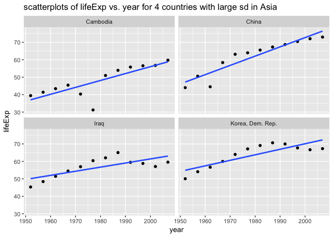
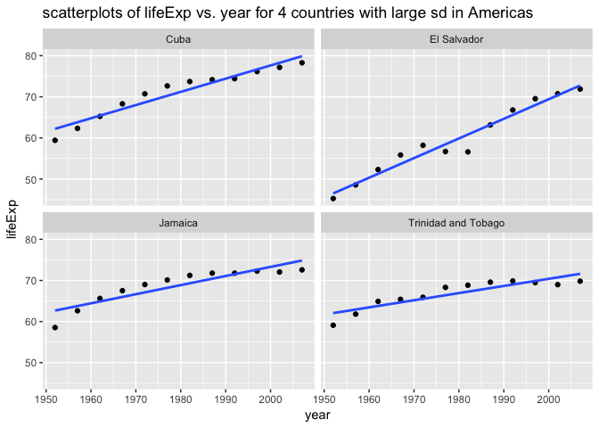
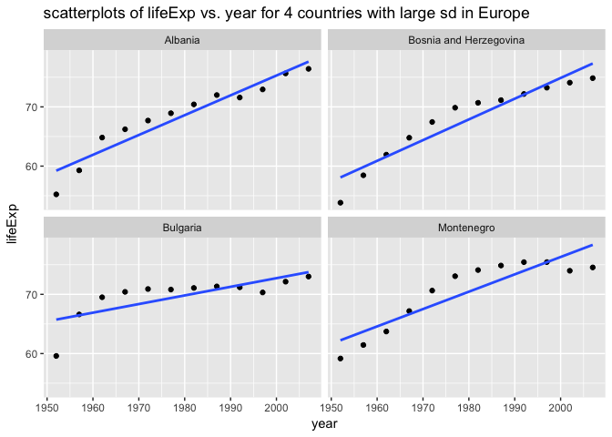

03\_gap-report
================
Xinzhe Dong
November 12, 2017

This is an R Markdown document. It is a combination of the Rscripts in `00_download-data.R`, `01_filter-reorder-plot.R`, and `02_statistical_analysis.R`.

I will demonstrate how to use `rmarkdown::render()` without the help of RStudio's buttons. We will, in fact, call `rmarkdown::render()` from within a `Makefile`.

### Load the required packages

``` r
library(forcats)
library(ggplot2)
library(plyr)
library(dplyr)
library(broom)
library(tidyverse)
library(kableExtra)
library(knitr)
library(MASS)
```

### 00\_download-data.R

``` r
download.file("https://raw.githubusercontent.com/jennybc/gapminder/master/inst/extdata/gapminder.tsv", destfile="gapminder.tsv")
```

### 01\_filter-reorder-plot.R

**1.** bring the data in as data frame

``` r
gapminder <- read.delim("gapminder.tsv")
```

**2.** make some plots

``` r
# a boxplot of lifeExp and continents
p1 <- ggplot(gapminder, aes(x = continent, y = lifeExp, color=continent)) + geom_boxplot() +
    labs(title="a boxplot of lifeExp and continents")
# ggsave("boxplot_of_lifeExp_and_continents.png", p1)
p1
```


``` r
# a scatterplot of lifeExp vs. year
p2 <- ggplot(gapminder, aes(x=year, y=lifeExp)) + geom_point(aes(color=continent),alpha=0.5) +
    labs(title="a scatterplot of lifeExp vs. year")
# ggsave("scatterplot_of_lifeExp_vs._year.png", p2)
p2
```


**3.** reorder Gapminder continents by minimum of lifeExp.

``` r
new_continent<-fct_reorder(gapminder$continent, gapminder$lifeExp, min)

## implement the new continent ordering, 
## order the data frame by year, then by life expectancy,
## rearrange the variables so that year comes first, followed by life expectancy,
## drop least frequent continents
gapminder <- gapminder%>%
  mutate(continent = new_continent)%>%
  arrange(year, lifeExp) %>% 
  dplyr::select(year, lifeExp, everything())%>%
  filter(continent != "Oceania")%>%
  droplevels()
```

### 02\_statistical\_analysis.R

**1.** Use the data created in the first script, make sure the new continent order is still in force.

``` r
gapminder%>%
  group_by(continent)%>%
  summarise(min(lifeExp))
```

    ## # A tibble: 4 x 2
    ##   continent `min(lifeExp)`
    ##      <fctr>          <dbl>
    ## 1    Africa         23.599
    ## 2      Asia         28.801
    ## 3  Americas         37.579
    ## 4    Europe         43.585

**2.** Fit a linear regression of life expectancy on year within each country.

``` r
le_l_yr <- function(df) {
  lm(lifeExp ~ I(year - 1950), data = df)
}

gap_nested2 <- gapminder %>% 
  group_by(continent, country) %>% 
  nest()

gap_coefs2 <- gap_nested2 %>% 
  mutate(fit = map(data, le_l_yr),
         tidy = map(fit, tidy)) %>% 
  dplyr::select(continent, country, tidy) %>% 
  unnest(tidy)

gap_coefs2 <- gap_coefs2 %>%
  mutate(term = recode(term,
                       `(Intercept)` = "intercept",
                       `I(year - 1950)` = "slope"))

gap_ests2 <- gap_coefs2 %>% 
  dplyr::select(continent:std.error) %>% 
  spread(key = term, value = estimate)

gap_ests2
```

    ## # A tibble: 280 x 5
    ##    continent      country  std.error intercept      slope
    ##  *    <fctr>       <fctr>      <dbl>     <dbl>      <dbl>
    ##  1    Africa      Algeria 0.02212707        NA 0.56927972
    ##  2    Africa      Algeria 0.75626904  42.23641         NA
    ##  3    Africa       Angola 0.02353200        NA 0.20933986
    ##  4    Africa       Angola 0.80428746  31.70797         NA
    ##  5    Africa        Benin 0.01964652        NA 0.33423287
    ##  6    Africa        Benin 0.67148763  38.92005         NA
    ##  7    Africa     Botswana 0.10222519        NA 0.06066853
    ##  8    Africa     Botswana 3.49389885  52.80778         NA
    ##  9    Africa Burkina Faso 0.03423728        NA 0.36397483
    ## 10    Africa Burkina Faso 1.17017721  33.95674         NA
    ## # ... with 270 more rows

**3.** Find the 3 or 4 “worst” and “best” countries for each continent. I will choose 4 countries in each continent with the largest std.error as the "worst" countries. Since large residual std.error indicates that the linear model fit the data poorly.

``` r
large_sd_africa <- gap_ests2%>%
  filter(continent=="Africa")%>%
  arrange(desc(std.error))

country_africa <- head(large_sd_africa,4)[,c("continent","country","std.error")]


large_sd_asia <- gap_ests2%>%
  filter(continent=="Asia")%>%
  arrange(desc(std.error))
country_asia <- head(large_sd_asia,4)[,c("continent","country","std.error")]

  
large_sd_america <- gap_ests2%>%
  filter(continent=="Americas")%>%
  arrange(desc(std.error))
country_america <- head(large_sd_america,4)[,c("continent","country","std.error")]


large_sd_europe <- gap_ests2%>%
  filter(continent=="Europe")%>%
  arrange(desc(std.error))
country_europe <- head(large_sd_europe,4)[,c("continent","country","std.error")]


country_large_se <- list(country_africa,country_asia,country_america,country_europe) %>%
  Reduce(function(dtf1,dtf2) full_join(dtf1,dtf2,by = c("continent", "country", "std.error")), .)

country_large_se%>%
    knitr::kable()
```

| continent | country                |  std.error|
|:----------|:-----------------------|----------:|
| Africa    | Zimbabwe               |  4.1188344|
| Africa    | Swaziland              |  3.7979564|
| Africa    | Rwanda                 |  3.7488981|
| Africa    | Botswana               |  3.4938988|
| Asia      | Cambodia               |  3.2183541|
| Asia      | Iraq                   |  2.3191547|
| Asia      | Korea, Dem. Rep.       |  2.2225950|
| Asia      | China                  |  2.2047682|
| Americas  | Jamaica                |  1.1752373|
| Americas  | El Salvador            |  1.1106673|
| Americas  | Cuba                   |  0.9950017|
| Americas  | Trinidad and Tobago    |  0.9443223|
| Europe    | Montenegro             |  1.5741706|
| Europe    | Bulgaria               |  1.4342842|
| Europe    | Bosnia and Herzegovina |  1.2899756|
| Europe    | Albania                |  1.1335758|

**4.** Create a figure for each continent, and write one file per continent, with an informative name. The figure should give scatterplots of life expectancy vs. year for the 4 countries found above for each continent, fitted line overlaid.

``` r
# for Africa
p_africa <- gapminder%>%
  filter(country %in% c("Zimbabwe", "Swaziland","Rwanda","Botswana"))%>%
  ggplot(aes(x = year, y=lifeExp)) + geom_point() + geom_smooth(se=FALSE, method="lm") +
  facet_wrap(~ country) + 
    labs(title="scatterplots of lifeExp vs. year for 4 countries with large sd in Africa")
p_africa
```


``` r
# for Asia
p_asia <- gapminder%>%
  filter(country %in% c("Cambodia", "Iraq","Korea, Dem. Rep.","China"))%>%
  ggplot(aes(x = year, y=lifeExp)) + geom_point() + geom_smooth(se=FALSE, method="lm") +
  facet_wrap(~ country) + 
    labs(title="scatterplots of lifeExp vs. year for 4 countries with large sd in Asia")
p_asia
```



``` r
# for Americas
p_americas <- gapminder%>%
  filter(country %in% c("Jamaica", "El Salvador","Cuba","Trinidad and Tobago"))%>%
  ggplot(aes(x = year, y=lifeExp)) + geom_point() + geom_smooth(se=FALSE, method="lm") +
  facet_wrap(~ country) + 
    labs(title="scatterplots of lifeExp vs. year for 4 countries with large sd in Americas")
p_americas
```



``` r
# for Europe
p_europe <- gapminder%>%
  filter(country %in% c("Montenegro", "Bulgaria","Bosnia and Herzegovina","Albania"))%>%
  ggplot(aes(x = year, y=lifeExp)) + geom_point() + geom_smooth(se=FALSE, method="lm") +
  facet_wrap(~ country) + 
    labs(title="scatterplots of lifeExp vs. year for 4 countries with large sd in Europe")
p_europe
```


