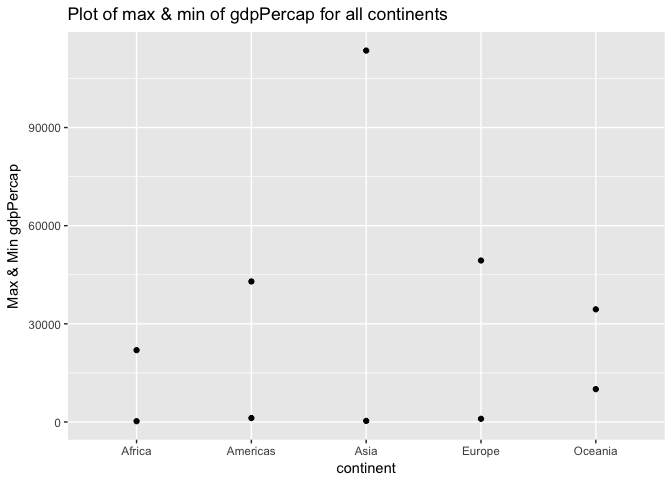
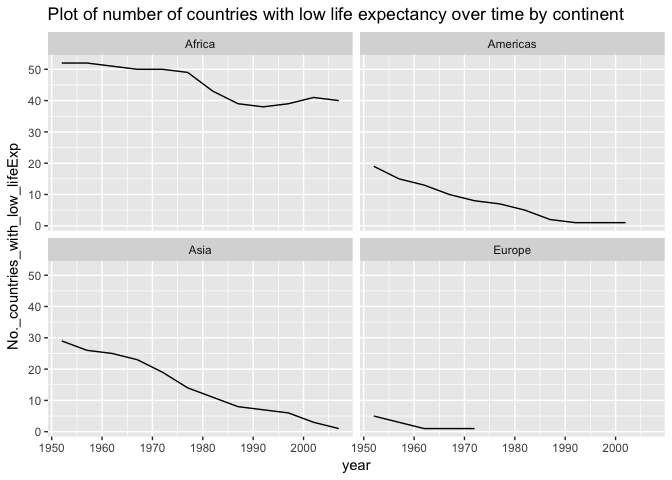

hw03
================
Xinzhe Dong
September 26, 2017

### load the packages

    ## Loading tidyverse: ggplot2
    ## Loading tidyverse: tibble
    ## Loading tidyverse: tidyr
    ## Loading tidyverse: readr
    ## Loading tidyverse: purrr
    ## Loading tidyverse: dplyr

    ## Conflicts with tidy packages ----------------------------------------------

    ## filter(): dplyr, stats
    ## lag():    dplyr, stats

### 1. Get the maximum and minimum of GDP per capita for all continents.

``` r
gapminder %>% 
  group_by(continent) %>% 
  summarize(min_gdpPercap=min(gdpPercap), max_gdpPercap=max(gdpPercap), range = max_gdpPercap - min_gdpPercap)
```

    ## # A tibble: 5 x 4
    ##   continent min_gdpPercap max_gdpPercap     range
    ##      <fctr>         <dbl>         <dbl>     <dbl>
    ## 1    Africa      241.1659      21951.21  21710.05
    ## 2  Americas     1201.6372      42951.65  41750.02
    ## 3      Asia      331.0000     113523.13 113192.13
    ## 4    Europe      973.5332      49357.19  48383.66
    ## 5   Oceania    10039.5956      34435.37  24395.77

#### Plot the max and min of GDP per capita for all continents.

``` r
gapminder %>% 
  group_by(continent) %>% 
  summarize(min_gdpPercap=min(gdpPercap), max_gdpPercap=max(gdpPercap))%>%
  ggplot(aes(x = continent)) + 
  geom_point(aes(y = min_gdpPercap)) +
  geom_point(aes(y = max_gdpPercap)) +
  labs(y="Max & Min gdpPercap", title= "Plot of max & min of gdpPercap for all continents") 
```



#### We observe the followings:

-   Both the maximum and minimum of GDP per capita for Africa is the smallest among the five continents.

-   Asia has the largest range of GDP per capita, and the largest maximum of GDP per capita.

-   Oceania has the largest minimum gdpPercap.

### 2. Look at the spread of GDP per capita within the continents.

``` r
# Statistical summary of gdpPercap within continents
gapminder%>%
  group_by(continent)%>%
  summarize(min_gdpPercap=min(gdpPercap), first_q=quantile(gdpPercap)[2], median_gdpPercap=median(gdpPercap), third_q=quantile(gdpPercap)[4], max_gdpPercap=max(gdpPercap))
```

    ## # A tibble: 5 x 6
    ##   continent min_gdpPercap   first_q median_gdpPercap   third_q
    ##      <fctr>         <dbl>     <dbl>            <dbl>     <dbl>
    ## 1    Africa      241.1659   761.247         1192.138  2377.417
    ## 2  Americas     1201.6372  3427.779         5465.510  7830.210
    ## 3      Asia      331.0000  1056.993         2646.787  8549.256
    ## 4    Europe      973.5332  7213.085        12081.749 20461.386
    ## 5   Oceania    10039.5956 14141.859        17983.304 22214.117
    ## # ... with 1 more variables: max_gdpPercap <dbl>

``` r
# A density plot of gdpPercap
ggplot(gapminder, aes(x = gdpPercap, color = continent)) + geom_density() +
    labs(title= "Density plot of gdpPercap within the continents") 
```


``` r
# boxplots of GDP per capita for all continents. 
ggplot(gapminder, aes(x = continent, y = gdpPercap)) + geom_boxplot() +
      labs(title= "Boxplot of gdpPercap within the continents") 
```


#### From the above two plots, we observe that:

-   Oceania has the largest median of gdpPercap among the five continents. Europe has the second largest median of gdpPercap among the five continents.

-   Africa has the smallest median of gdpPercap among the five continents.

-   The gdpPercap of Asia is more widely spreaded than the other continents.

-   The gdpPercap of the five countries are all skewed to the right. The distribution of gdpPercap of Oceania is closer to the normal distribution.

### 3. Compute a weighted mean, weighting by population, of life expectancy for different years.

``` r
gapminder %>% 
  group_by(year) %>% 
  summarize(mean_lifeex=weighted.mean(lifeExp,pop))
```

    ## # A tibble: 12 x 2
    ##     year mean_lifeex
    ##    <int>       <dbl>
    ##  1  1952    48.94424
    ##  2  1957    52.12189
    ##  3  1962    52.32438
    ##  4  1967    56.98431
    ##  5  1972    59.51478
    ##  6  1977    61.23726
    ##  7  1982    62.88176
    ##  8  1987    64.41635
    ##  9  1992    65.64590
    ## 10  1997    66.84934
    ## 11  2002    67.83904
    ## 12  2007    68.91909

#### Plot the weighted mean of life expectancy vs. year.

``` r
gapminder %>% 
  group_by(year) %>% 
  summarize(mean_lifeex=weighted.mean(lifeExp,pop)) %>%
  ggplot(aes(x = year, y = mean_lifeex)) + geom_line() +
      labs(title= "Plot of weighted mean of life expectancy vs. year") 
```


#### From the plot, we can tell that:

The weighted mean of life expectancy from 1952 to 2007 is increasing at an approximately constant rate.

### 4. How is life expectancy changing over time on different continents?

#### Calculate the mean life expectancy over time on different continents

``` r
gapminder %>%
  group_by(continent,year)%>%
  summarize(mean_lifeExp = mean(lifeExp))
```

    ## # A tibble: 60 x 3
    ## # Groups:   continent [?]
    ##    continent  year mean_lifeExp
    ##       <fctr> <int>        <dbl>
    ##  1    Africa  1952     39.13550
    ##  2    Africa  1957     41.26635
    ##  3    Africa  1962     43.31944
    ##  4    Africa  1967     45.33454
    ##  5    Africa  1972     47.45094
    ##  6    Africa  1977     49.58042
    ##  7    Africa  1982     51.59287
    ##  8    Africa  1987     53.34479
    ##  9    Africa  1992     53.62958
    ## 10    Africa  1997     53.59827
    ## # ... with 50 more rows

#### Plot life expectancy vs. year on different continents

``` r
p1 <- ggplot(data = gapminder) + 
  geom_point(mapping = aes(x = year, y = lifeExp)) + 
  facet_wrap(~ continent, nrow = 2) + 
        labs(title= "Plot of life expectancy over time on different continents") 

p1 + theme_bw() +
  theme(strip.background = element_rect(fill="orange"),
          axis.title = element_text(size=14),
          strip.text = element_text(size=14, face="bold"))
```


#### We can tell that:

The life expectancy is increasing over time on all the continents.

### 5. Report the absolute and/or relative abundance of countries with low life expectancy over time by continent:

Compute a mean of life expectancy worldwide. Then determine how many countries on each continent have a life expectancy less than the mean life expectancy, for each year.

``` r
average_age <- mean(gapminder$lifeExp)
gapminder %>% 
  filter(lifeExp<average_age) %>%
    group_by(continent,year) %>% 
    summarize(No._countries_with_low_lifeExp=length(country))
```

    ## # A tibble: 40 x 3
    ## # Groups:   continent [?]
    ##    continent  year No._countries_with_low_lifeExp
    ##       <fctr> <int>                          <int>
    ##  1    Africa  1952                             52
    ##  2    Africa  1957                             52
    ##  3    Africa  1962                             51
    ##  4    Africa  1967                             50
    ##  5    Africa  1972                             50
    ##  6    Africa  1977                             49
    ##  7    Africa  1982                             43
    ##  8    Africa  1987                             39
    ##  9    Africa  1992                             38
    ## 10    Africa  1997                             39
    ## # ... with 30 more rows

#### Note:

-   If there is no value for a continent on that year. then it means there is no country that year on that continent has a life expectancy less than the mean life expectancy.

-   For example: There is no value for the continent "Oceania" in any year, which means Oceania does not have any country which has a life expectancy less than the mean life expectancy during the whole data collection period.

#### Plot the number of countries with low life expectancy over time by continent.

``` r
gapminder %>% 
  filter(lifeExp<average_age) %>%
    group_by(continent,year) %>% 
    summarize(No._countries_with_low_lifeExp=length(country)) %>%
    ggplot(aes(x = year, y = No._countries_with_low_lifeExp)) + geom_line() +
      facet_wrap(~ continent, nrow = 2) +
          labs(title= "Plot of number of countries with low life expectancy over time by continent") 
```



#### From the plots, we can tell that:

-   The number of countries with low life expectancy is decreasing over time in each continent.

-   There is not plot for Oceania, because Oceania does not have any country which has a life expectancy less than the mean life expectancy during the whole data collection period.

-   For Americas and Europe, the number of countries with low life expectancy decreases to zero after a time, so the line on their graph is shorter compare to the line on the graph of Africa and Asia.

### 6. But I want to do more!

#### (1) Get table and figure side-by-side

``` r
library(ggplot2)
suppressMessages(library(dplyr))
#devtools::install_github("jennybc/gapminder")
library("gapminder")
gtbl <- tbl_df(gapminder)
```

    ## `summarise_each()` is deprecated.
    ## Use `summarise_all()`, `summarise_at()` or `summarise_if()` instead.
    ## To map `funs` over a selection of variables, use `summarise_at()`

| continent |  gdpPercap\_mean|  gdpPercap\_median|
|:----------|----------------:|------------------:|
| Africa    |         2193.755|           1192.138|
| Americas  |         7136.110|           5465.510|
| Asia      |         7902.150|           2646.787|
| Europe    |        14469.476|          12081.749|
| Oceania   |        18621.609|          17983.304|


<style type="text/css">
.twoC {width: 100%}
.clearer {clear: both}
.twoC .table {max-width: 50%; float: right}
.twoC img {max-width: 50%; float: left}
</style>
#### (2) Try a table helper package (pander)

``` r
gapminder %>%
  filter(country=="Australia", year %in% c(1952,2007 ))%>%
  pandoc.table(style = "grid", caption = "Entries of Australia in 1952 and 2007")
```

    ## 
    ## 
    ## +-----------+-----------+------+---------+----------+-----------+
    ## |  country  | continent | year | lifeExp |   pop    | gdpPercap |
    ## +===========+===========+======+=========+==========+===========+
    ## | Australia |  Oceania  | 1952 |  69.12  | 8691212  |   10040   |
    ## +-----------+-----------+------+---------+----------+-----------+
    ## | Australia |  Oceania  | 2007 |  81.23  | 20434176 |   34435   |
    ## +-----------+-----------+------+---------+----------+-----------+
    ## 
    ## Table: Entries of Australia in 1952 and 2007
