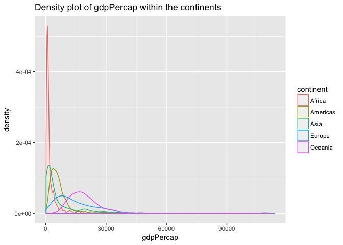
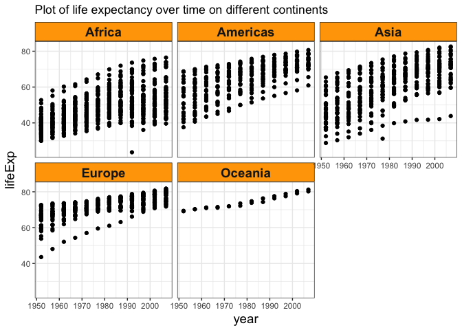

# hw03
Xinzhe Dong  
September 26, 2017  

### load the packages


```r
library(gapminder)
library(tidyverse)
```

```
## Loading tidyverse: ggplot2
## Loading tidyverse: tibble
## Loading tidyverse: tidyr
## Loading tidyverse: readr
## Loading tidyverse: purrr
## Loading tidyverse: dplyr
```

```
## Conflicts with tidy packages ----------------------------------------------
```

```
## filter(): dplyr, stats
## lag():    dplyr, stats
```

```r
library(knitr)
library(kableExtra)
library(ggplot2)
library(forcats)
```


### 1. Get the maximum and minimum of GDP per capita for all continents.


```r
gapminder %>% 
  group_by(continent) %>% 
  summarize(min_gdpPercap=min(gdpPercap), max_gdpPercap=max(gdpPercap))
```

```
## # A tibble: 5 x 3
##   continent min_gdpPercap max_gdpPercap
##      <fctr>         <dbl>         <dbl>
## 1    Africa      241.1659      21951.21
## 2  Americas     1201.6372      42951.65
## 3      Asia      331.0000     113523.13
## 4    Europe      973.5332      49357.19
## 5   Oceania    10039.5956      34435.37
```

Plot the max and min values

```r
gapminder %>% 
  group_by(continent) %>% 
  summarize(min_gdpPercap=min(gdpPercap), max_gdpPercap=max(gdpPercap))%>%
  ggplot(aes(x = continent)) + 
  geom_point(aes(y = min_gdpPercap)) +
  geom_point(aes(y = max_gdpPercap)) +
  labs(y="Max & Min gdpPercap") 
```

<!-- -->


### 2. Look at the spread of GDP per capita within the continents.


```r
# A density plot of gdpPercap
ggplot(gapminder, aes(x = gdpPercap, color = continent)) + geom_density()
```

<!-- -->

```r
# boxplots of GDP per capita for all continents. 
ggplot(gapminder, aes(x = continent, y = gdpPercap)) + geom_boxplot()
```

<!-- -->


### 3. Compute a weighted mean, weighting by population, of life expectancy for different years. 


```r
gapminder %>% 
  group_by(year) %>% 
  summarize(mean_lifeex=weighted.mean(lifeExp,pop))
```

```
## # A tibble: 12 x 2
##     year mean_lifeex
##    <int>       <dbl>
##  1  1952    48.94424
##  2  1957    52.12189
##  3  1962    52.32438
##  4  1967    56.98431
##  5  1972    59.51478
##  6  1977    61.23726
##  7  1982    62.88176
##  8  1987    64.41635
##  9  1992    65.64590
## 10  1997    66.84934
## 11  2002    67.83904
## 12  2007    68.91909
```

Plot the weighted mean of life expectancy vs. year.

```r
gapminder %>% 
  group_by(year) %>% 
  summarize(mean_lifeex=weighted.mean(lifeExp,pop)) %>%
  ggplot(aes(x = year, y = mean_lifeex)) + geom_line()
```

<!-- -->


### 4. How is life expectancy changing over time on different continents?


```r
ggplot(data = gapminder) + 
  geom_point(mapping = aes(x = year, y = lifeExp)) + 
  facet_wrap(~ continent, nrow = 2)
```

<!-- -->


### 5. Report the absolute and/or relative abundance of countries with low life expectancy over time by continent: 

Compute a mean of life expectancy worldwide. Then determine how many countries on each continent have a life expectancy less than the mean life expectancy, for each year.

Note:

* If there is no value for a continent on that year. then it means there is no country that year on that continent has a life expectancy less than the mean life expectancy.
* For example: There is no value for the continent "Oceania" in any year, which means Oceania does not have any country which has a life expectancy less than the mean life expectancy during the whole data collection period.


```r
average_age <- mean(gapminder$lifeExp)
gapminder %>% 
  filter(lifeExp<average_age) %>%
    group_by(continent,year) %>% 
    summarize(No._countries_with_low_lifeExp=length(country))
```

```
## # A tibble: 40 x 3
## # Groups:   continent [?]
##    continent  year No._countries_with_low_lifeExp
##       <fctr> <int>                          <int>
##  1    Africa  1952                             52
##  2    Africa  1957                             52
##  3    Africa  1962                             51
##  4    Africa  1967                             50
##  5    Africa  1972                             50
##  6    Africa  1977                             49
##  7    Africa  1982                             43
##  8    Africa  1987                             39
##  9    Africa  1992                             38
## 10    Africa  1997                             39
## # ... with 30 more rows
```


Plot the number of countries with low life expectancy over time by continent.


```r
gapminder %>% 
  filter(lifeExp<average_age) %>%
    group_by(continent,year) %>% 
    summarize(No._countries_with_low_lifeExp=length(country)) %>%
    ggplot(aes(x = year, y = No._countries_with_low_lifeExp)) + geom_line() +
      facet_wrap(~ continent, nrow = 2)
```

<!-- -->

Note: 

* There is not graph for Oceania, because Oceania does not have any country which has a life expectancy less than the mean life expectancy during the whole data collection period.

* For Americas and Europe, the number of countries with low life expectancy decreases to zero after a time, so the line on their graph is shorter compare to the line on the graph of Africa and Asia.
