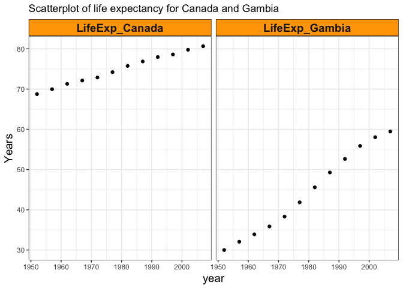

hw04
================
Xinzhe Dong
October 4, 2017

### Abstract

We are going to explore the gapminder data set. We will be practicing data reshaping and join.

#### Table of content

-   [Load data and packages](#load-data-and-packages)
-   [General data reshaping and relationship to aggregation](#general-data-reshaping-and-relationship-to-aggregation)
-   [Join, merge, look up](#join-merge-look-up)

Load data and packages
----------------------

[*Back to the top*](#abstract)

``` r
library(gapminder)
library(tidyverse)
```

    ## Loading tidyverse: ggplot2
    ## Loading tidyverse: tibble
    ## Loading tidyverse: tidyr
    ## Loading tidyverse: readr
    ## Loading tidyverse: purrr
    ## Loading tidyverse: dplyr

    ## Conflicts with tidy packages ----------------------------------------------

    ## filter(): dplyr, stats
    ## lag():    dplyr, stats

``` r
library(knitr)
library(kableExtra)
library(ggplot2)
library(forcats)
library(pander)
```

General data reshaping and relationship to aggregation
------------------------------------------------------

[*Back to the top*](#abstract)

#### I choose to work on `Activity #2`

**1. Make a tibble with one row per year and columns for life expectancy for Canada and Gambia.**

``` r
# get (average) life expectancy for Canada over years
(lifeexp_Canada <- filter(gapminder,country=="Canada")%>%
    group_by(year)%>%
    summarize(lifeExp))
```

    ## # A tibble: 12 x 2
    ##     year lifeExp
    ##    <int>   <dbl>
    ##  1  1952  68.750
    ##  2  1957  69.960
    ##  3  1962  71.300
    ##  4  1967  72.130
    ##  5  1972  72.880
    ##  6  1977  74.210
    ##  7  1982  75.760
    ##  8  1987  76.860
    ##  9  1992  77.950
    ## 10  1997  78.610
    ## 11  2002  79.770
    ## 12  2007  80.653

``` r
# get (average) life expectancy for Gambia over years
(lifeexp_Gambia <- filter(gapminder,country=="Gambia")%>%
    group_by(year)%>%
    summarize(lifeExp))
```

    ## # A tibble: 12 x 2
    ##     year lifeExp
    ##    <int>   <dbl>
    ##  1  1952  30.000
    ##  2  1957  32.065
    ##  3  1962  33.896
    ##  4  1967  35.857
    ##  5  1972  38.308
    ##  6  1977  41.842
    ##  7  1982  45.580
    ##  8  1987  49.265
    ##  9  1992  52.644
    ## 10  1997  55.861
    ## 11  2002  58.041
    ## 12  2007  59.448

``` r
# Construct a tibble that joins lifeexp_Canada, and lifeexp_Gambia.
year_lifeexp <- full_join(lifeexp_Canada, lifeexp_Gambia, by="year")
colnames(year_lifeexp) <- c("year", "LifeExp_Canada", "LifeExp_Gambia")
```

**2. Use kable() to render the table.**

``` r
year_lifeexp%>%
    kable("html",caption="Life Expectancy for Canada and Gambia")%>%
    kable_styling(bootstrap_options = c("striped", "hover", "condensed", "responsive"))
```

<table class="table table-striped table-hover table-condensed table-responsive" style="margin-left: auto; margin-right: auto;">
<caption>
Life Expectancy for Canada and Gambia
</caption>
<thead>
<tr>
<th style="text-align:right;">
year
</th>
<th style="text-align:right;">
LifeExp\_Canada
</th>
<th style="text-align:right;">
LifeExp\_Gambia
</th>
</tr>
</thead>
<tbody>
<tr>
<td style="text-align:right;">
1952
</td>
<td style="text-align:right;">
68.750
</td>
<td style="text-align:right;">
30.000
</td>
</tr>
<tr>
<td style="text-align:right;">
1957
</td>
<td style="text-align:right;">
69.960
</td>
<td style="text-align:right;">
32.065
</td>
</tr>
<tr>
<td style="text-align:right;">
1962
</td>
<td style="text-align:right;">
71.300
</td>
<td style="text-align:right;">
33.896
</td>
</tr>
<tr>
<td style="text-align:right;">
1967
</td>
<td style="text-align:right;">
72.130
</td>
<td style="text-align:right;">
35.857
</td>
</tr>
<tr>
<td style="text-align:right;">
1972
</td>
<td style="text-align:right;">
72.880
</td>
<td style="text-align:right;">
38.308
</td>
</tr>
<tr>
<td style="text-align:right;">
1977
</td>
<td style="text-align:right;">
74.210
</td>
<td style="text-align:right;">
41.842
</td>
</tr>
<tr>
<td style="text-align:right;">
1982
</td>
<td style="text-align:right;">
75.760
</td>
<td style="text-align:right;">
45.580
</td>
</tr>
<tr>
<td style="text-align:right;">
1987
</td>
<td style="text-align:right;">
76.860
</td>
<td style="text-align:right;">
49.265
</td>
</tr>
<tr>
<td style="text-align:right;">
1992
</td>
<td style="text-align:right;">
77.950
</td>
<td style="text-align:right;">
52.644
</td>
</tr>
<tr>
<td style="text-align:right;">
1997
</td>
<td style="text-align:right;">
78.610
</td>
<td style="text-align:right;">
55.861
</td>
</tr>
<tr>
<td style="text-align:right;">
2002
</td>
<td style="text-align:right;">
79.770
</td>
<td style="text-align:right;">
58.041
</td>
</tr>
<tr>
<td style="text-align:right;">
2007
</td>
<td style="text-align:right;">
80.653
</td>
<td style="text-align:right;">
59.448
</td>
</tr>
</tbody>
</table>
We can tell from this table that overs the years, Canada always has a greater (average) life expectancy than Gambia.

**3. Gather LifeExp\_Canada and LifeExp\_Gambia.**

``` r
year_lifeexp_tidy <- year_lifeexp %>%
  gather(key = "LifeExp", value = "Years", LifeExp_Canada, LifeExp_Gambia)
```

**4. Again, use kable() to render the tidy table.**

``` r
year_lifeexp_tidy%>%
    kable("html",caption="Life Expectancy for Canada and Gambia (tidy)")%>%
    kable_styling(bootstrap_options = c("striped", "hover", "condensed", "responsive"))
```

<table class="table table-striped table-hover table-condensed table-responsive" style="margin-left: auto; margin-right: auto;">
<caption>
Life Expectancy for Canada and Gambia (tidy)
</caption>
<thead>
<tr>
<th style="text-align:right;">
year
</th>
<th style="text-align:left;">
LifeExp
</th>
<th style="text-align:right;">
Years
</th>
</tr>
</thead>
<tbody>
<tr>
<td style="text-align:right;">
1952
</td>
<td style="text-align:left;">
LifeExp\_Canada
</td>
<td style="text-align:right;">
68.750
</td>
</tr>
<tr>
<td style="text-align:right;">
1957
</td>
<td style="text-align:left;">
LifeExp\_Canada
</td>
<td style="text-align:right;">
69.960
</td>
</tr>
<tr>
<td style="text-align:right;">
1962
</td>
<td style="text-align:left;">
LifeExp\_Canada
</td>
<td style="text-align:right;">
71.300
</td>
</tr>
<tr>
<td style="text-align:right;">
1967
</td>
<td style="text-align:left;">
LifeExp\_Canada
</td>
<td style="text-align:right;">
72.130
</td>
</tr>
<tr>
<td style="text-align:right;">
1972
</td>
<td style="text-align:left;">
LifeExp\_Canada
</td>
<td style="text-align:right;">
72.880
</td>
</tr>
<tr>
<td style="text-align:right;">
1977
</td>
<td style="text-align:left;">
LifeExp\_Canada
</td>
<td style="text-align:right;">
74.210
</td>
</tr>
<tr>
<td style="text-align:right;">
1982
</td>
<td style="text-align:left;">
LifeExp\_Canada
</td>
<td style="text-align:right;">
75.760
</td>
</tr>
<tr>
<td style="text-align:right;">
1987
</td>
<td style="text-align:left;">
LifeExp\_Canada
</td>
<td style="text-align:right;">
76.860
</td>
</tr>
<tr>
<td style="text-align:right;">
1992
</td>
<td style="text-align:left;">
LifeExp\_Canada
</td>
<td style="text-align:right;">
77.950
</td>
</tr>
<tr>
<td style="text-align:right;">
1997
</td>
<td style="text-align:left;">
LifeExp\_Canada
</td>
<td style="text-align:right;">
78.610
</td>
</tr>
<tr>
<td style="text-align:right;">
2002
</td>
<td style="text-align:left;">
LifeExp\_Canada
</td>
<td style="text-align:right;">
79.770
</td>
</tr>
<tr>
<td style="text-align:right;">
2007
</td>
<td style="text-align:left;">
LifeExp\_Canada
</td>
<td style="text-align:right;">
80.653
</td>
</tr>
<tr>
<td style="text-align:right;">
1952
</td>
<td style="text-align:left;">
LifeExp\_Gambia
</td>
<td style="text-align:right;">
30.000
</td>
</tr>
<tr>
<td style="text-align:right;">
1957
</td>
<td style="text-align:left;">
LifeExp\_Gambia
</td>
<td style="text-align:right;">
32.065
</td>
</tr>
<tr>
<td style="text-align:right;">
1962
</td>
<td style="text-align:left;">
LifeExp\_Gambia
</td>
<td style="text-align:right;">
33.896
</td>
</tr>
<tr>
<td style="text-align:right;">
1967
</td>
<td style="text-align:left;">
LifeExp\_Gambia
</td>
<td style="text-align:right;">
35.857
</td>
</tr>
<tr>
<td style="text-align:right;">
1972
</td>
<td style="text-align:left;">
LifeExp\_Gambia
</td>
<td style="text-align:right;">
38.308
</td>
</tr>
<tr>
<td style="text-align:right;">
1977
</td>
<td style="text-align:left;">
LifeExp\_Gambia
</td>
<td style="text-align:right;">
41.842
</td>
</tr>
<tr>
<td style="text-align:right;">
1982
</td>
<td style="text-align:left;">
LifeExp\_Gambia
</td>
<td style="text-align:right;">
45.580
</td>
</tr>
<tr>
<td style="text-align:right;">
1987
</td>
<td style="text-align:left;">
LifeExp\_Gambia
</td>
<td style="text-align:right;">
49.265
</td>
</tr>
<tr>
<td style="text-align:right;">
1992
</td>
<td style="text-align:left;">
LifeExp\_Gambia
</td>
<td style="text-align:right;">
52.644
</td>
</tr>
<tr>
<td style="text-align:right;">
1997
</td>
<td style="text-align:left;">
LifeExp\_Gambia
</td>
<td style="text-align:right;">
55.861
</td>
</tr>
<tr>
<td style="text-align:right;">
2002
</td>
<td style="text-align:left;">
LifeExp\_Gambia
</td>
<td style="text-align:right;">
58.041
</td>
</tr>
<tr>
<td style="text-align:right;">
2007
</td>
<td style="text-align:left;">
LifeExp\_Gambia
</td>
<td style="text-align:right;">
59.448
</td>
</tr>
</tbody>
</table>
Tidy data ... mission accomplished!

**5. Scatterplot life expectancy for Canada and Gambia.**

``` r
p1 <- year_lifeexp_tidy %>%
    ggplot(aes(x=year, y=Years)) +
    geom_point() +
  facet_wrap( ~ LifeExp) +
    labs(title= "Scatterplot of life expectancy for Canada and Gambia") 

p1 + theme_bw() +
  theme(strip.background = element_rect(fill="orange"),
          axis.title = element_text(size=14),
          strip.text = element_text(size=14, face="bold"))
```



-   From this plot, we can tell that:

    -   The (average) life expectancy for Canada and Gambia is both increasing over the years.
    -   Even if the (average) life expectancy of Gambia is increasing at a greater rate than that of Canada, the (average) life expectancy of Gambia in 2017 is still lower than that of Canada in 1952.

Join, merge, look up
--------------------

[*Back to the top*](#abstract)

Create a second data frame, complementary to Gapminder. Join this with Gapminder using a dplyr join function and make some observations about the process and result. Explore the different types of joins.

**The second data frame**:

One row per continent("Asia", "Oceania", "Europe", "Antarctica"), a continent variable and two more variable with extra info. One is `areas of continents`, in square miles, and another one is `northern versus southern hemisphere`.

``` r
(extra_infor <- data.frame(continent=c("Asia", "Oceania", "Europe", "Antarctica"),
                     areas=c(17139445, 2967909, 3997929, 5405000),
                     hemisphere = c("northern", "southern", "northern", "southern")) %>% 
     as.tbl)
```

    ## # A tibble: 4 x 3
    ##    continent    areas hemisphere
    ##       <fctr>    <dbl>     <fctr>
    ## 1       Asia 17139445   northern
    ## 2    Oceania  2967909   southern
    ## 3     Europe  3997929   northern
    ## 4 Antarctica  5405000   southern

**1. To the `gapminder` dataset, add the "areas" and "hemisphere" variable using the `extra_infor` tibble.**

``` r
gapminder%>%
  left_join(extra_infor, by = "continent")
```

    ## Warning: Column `continent` joining factors with different levels, coercing
    ## to character vector

    ## # A tibble: 1,704 x 8
    ##        country continent  year lifeExp      pop gdpPercap    areas
    ##         <fctr>     <chr> <int>   <dbl>    <int>     <dbl>    <dbl>
    ##  1 Afghanistan      Asia  1952  28.801  8425333  779.4453 17139445
    ##  2 Afghanistan      Asia  1957  30.332  9240934  820.8530 17139445
    ##  3 Afghanistan      Asia  1962  31.997 10267083  853.1007 17139445
    ##  4 Afghanistan      Asia  1967  34.020 11537966  836.1971 17139445
    ##  5 Afghanistan      Asia  1972  36.088 13079460  739.9811 17139445
    ##  6 Afghanistan      Asia  1977  38.438 14880372  786.1134 17139445
    ##  7 Afghanistan      Asia  1982  39.854 12881816  978.0114 17139445
    ##  8 Afghanistan      Asia  1987  40.822 13867957  852.3959 17139445
    ##  9 Afghanistan      Asia  1992  41.674 16317921  649.3414 17139445
    ## 10 Afghanistan      Asia  1997  41.763 22227415  635.3414 17139445
    ## # ... with 1,694 more rows, and 1 more variables: hemisphere <fctr>

**2. To the `gapminder` dataset, add the "areas" and "hemisphere" variable using the `extra_infor` tibble, but only keeping obervations for which areas and hemisphere are available.**

``` r
gapminder%>%
  inner_join(extra_infor, by = "continent")
```

    ## Warning: Column `continent` joining factors with different levels, coercing
    ## to character vector

    ## # A tibble: 780 x 8
    ##        country continent  year lifeExp      pop gdpPercap    areas
    ##         <fctr>     <chr> <int>   <dbl>    <int>     <dbl>    <dbl>
    ##  1 Afghanistan      Asia  1952  28.801  8425333  779.4453 17139445
    ##  2 Afghanistan      Asia  1957  30.332  9240934  820.8530 17139445
    ##  3 Afghanistan      Asia  1962  31.997 10267083  853.1007 17139445
    ##  4 Afghanistan      Asia  1967  34.020 11537966  836.1971 17139445
    ##  5 Afghanistan      Asia  1972  36.088 13079460  739.9811 17139445
    ##  6 Afghanistan      Asia  1977  38.438 14880372  786.1134 17139445
    ##  7 Afghanistan      Asia  1982  39.854 12881816  978.0114 17139445
    ##  8 Afghanistan      Asia  1987  40.822 13867957  852.3959 17139445
    ##  9 Afghanistan      Asia  1992  41.674 16317921  649.3414 17139445
    ## 10 Afghanistan      Asia  1997  41.763 22227415  635.3414 17139445
    ## # ... with 770 more rows, and 1 more variables: hemisphere <fctr>

**3. Output the rows in `extra_infor` corresponding to continents that *are not* found in the `gapminder` dataset.**

``` r
extra_infor%>%
  anti_join(gapminder, by = "continent")
```

    ## Warning: Column `continent` joining factors with different levels, coercing
    ## to character vector

    ## # A tibble: 1 x 3
    ##    continent   areas hemisphere
    ##       <fctr>   <dbl>     <fctr>
    ## 1 Antarctica 5405000   southern

**4. Output the rows in `extra_infor` corresponding to continents that *are* found in the `gapminder` dataset.**

``` r
extra_infor%>%
  semi_join(gapminder, by = "continent")
```

    ## Warning: Column `continent` joining factors with different levels, coercing
    ## to character vector

    ## # A tibble: 3 x 3
    ##   continent    areas hemisphere
    ##      <fctr>    <dbl>     <fctr>
    ## 1      Asia 17139445   northern
    ## 2   Oceania  2967909   southern
    ## 3    Europe  3997929   northern

**5. Construct a tibble that joins `gapminder` and `extra_infor`, so that all rows found in each original tibble are also found in the final tibble.**

``` r
full_join(gapminder,extra_infor, by = "continent")
```

    ## Warning: Column `continent` joining factors with different levels, coercing
    ## to character vector

    ## # A tibble: 1,705 x 8
    ##        country continent  year lifeExp      pop gdpPercap    areas
    ##         <fctr>     <chr> <int>   <dbl>    <int>     <dbl>    <dbl>
    ##  1 Afghanistan      Asia  1952  28.801  8425333  779.4453 17139445
    ##  2 Afghanistan      Asia  1957  30.332  9240934  820.8530 17139445
    ##  3 Afghanistan      Asia  1962  31.997 10267083  853.1007 17139445
    ##  4 Afghanistan      Asia  1967  34.020 11537966  836.1971 17139445
    ##  5 Afghanistan      Asia  1972  36.088 13079460  739.9811 17139445
    ##  6 Afghanistan      Asia  1977  38.438 14880372  786.1134 17139445
    ##  7 Afghanistan      Asia  1982  39.854 12881816  978.0114 17139445
    ##  8 Afghanistan      Asia  1987  40.822 13867957  852.3959 17139445
    ##  9 Afghanistan      Asia  1992  41.674 16317921  649.3414 17139445
    ## 10 Afghanistan      Asia  1997  41.763 22227415  635.3414 17139445
    ## # ... with 1,695 more rows, and 1 more variables: hemisphere <fctr>

Here are the rows containing `Antarctica`:

``` r
full_join(gapminder,extra_infor, by = "continent")%>% 
    filter(continent=="Antarctica")
```

    ## Warning: Column `continent` joining factors with different levels, coercing
    ## to character vector

    ## # A tibble: 1 x 8
    ##   country  continent  year lifeExp   pop gdpPercap   areas hemisphere
    ##    <fctr>      <chr> <int>   <dbl> <int>     <dbl>   <dbl>     <fctr>
    ## 1    <NA> Antarctica    NA      NA    NA        NA 5405000   southern

**6. Subset the `gapminder` dataset to have continents that are only found in the `extra_infor` data frame.**

``` r
gapminder%>%
  semi_join(extra_infor)
```

    ## Joining, by = "continent"

    ## Warning: Column `continent` joining factors with different levels, coercing
    ## to character vector

    ## # A tibble: 780 x 6
    ##        country continent  year lifeExp      pop gdpPercap
    ##         <fctr>    <fctr> <int>   <dbl>    <int>     <dbl>
    ##  1 Afghanistan      Asia  1952  28.801  8425333  779.4453
    ##  2 Afghanistan      Asia  1957  30.332  9240934  820.8530
    ##  3 Afghanistan      Asia  1962  31.997 10267083  853.1007
    ##  4 Afghanistan      Asia  1967  34.020 11537966  836.1971
    ##  5 Afghanistan      Asia  1972  36.088 13079460  739.9811
    ##  6 Afghanistan      Asia  1977  38.438 14880372  786.1134
    ##  7 Afghanistan      Asia  1982  39.854 12881816  978.0114
    ##  8 Afghanistan      Asia  1987  40.822 13867957  852.3959
    ##  9 Afghanistan      Asia  1992  41.674 16317921  649.3414
    ## 10 Afghanistan      Asia  1997  41.763 22227415  635.3414
    ## # ... with 770 more rows

**7. Subset the `gapminder` dataset to have continents that are *not* found in the `extra_infor` data frame.**

``` r
gapminder%>%
  anti_join(extra_infor)
```

    ## Joining, by = "continent"

    ## Warning: Column `continent` joining factors with different levels, coercing
    ## to character vector

    ## # A tibble: 924 x 6
    ##    country continent  year lifeExp      pop gdpPercap
    ##     <fctr>    <fctr> <int>   <dbl>    <int>     <dbl>
    ##  1 Algeria    Africa  1952  43.077  9279525  2449.008
    ##  2 Algeria    Africa  1957  45.685 10270856  3013.976
    ##  3 Algeria    Africa  1962  48.303 11000948  2550.817
    ##  4 Algeria    Africa  1967  51.407 12760499  3246.992
    ##  5 Algeria    Africa  1972  54.518 14760787  4182.664
    ##  6 Algeria    Africa  1977  58.014 17152804  4910.417
    ##  7 Algeria    Africa  1982  61.368 20033753  5745.160
    ##  8 Algeria    Africa  1987  65.799 23254956  5681.359
    ##  9 Algeria    Africa  1992  67.744 26298373  5023.217
    ## 10 Algeria    Africa  1997  69.152 29072015  4797.295
    ## # ... with 914 more rows

Let’s check…. Asia should not be in there:

``` r
anti_join(gapminder, extra_infor) %>% 
    filter(country=="Asia")
```

    ## Joining, by = "continent"

    ## Warning: Column `continent` joining factors with different levels, coercing
    ## to character vector

    ## # A tibble: 0 x 6
    ## # ... with 6 variables: country <fctr>, continent <fctr>, year <int>,
    ## #   lifeExp <dbl>, pop <int>, gdpPercap <dbl>
