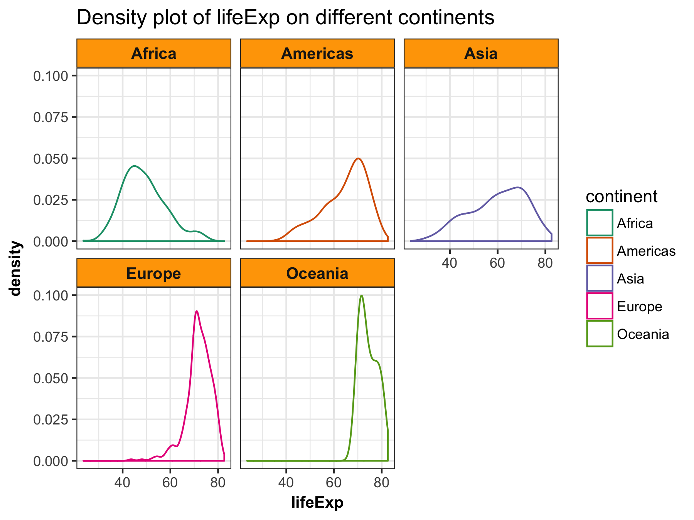
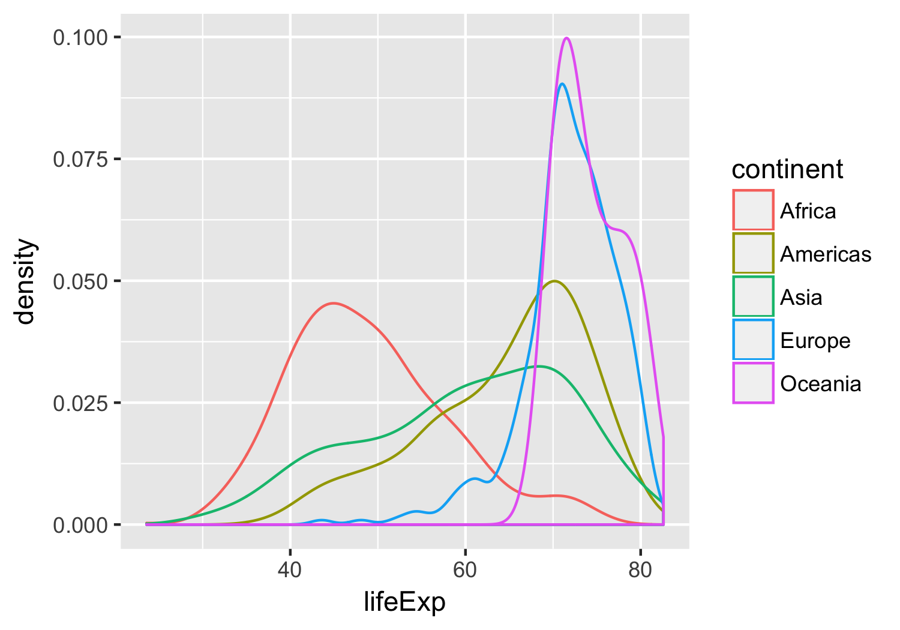

### Abstract

We are going to explore the gapminder data set. We will be practicing data reshaping and join.

#### Table of content
-   [Load data and packages](#load-data-and-packages)
-   [Factor management](#factor-management)
-   [File I/O](#file-io)
-   [Visualization design](#visualization-design)
-   [Writing figures to file](#writing-figures-to-file)
-   [But I want to do more!](#but-i-want-to-do-more)


Load data and packages
----------------------

[*Back to the top*](#abstract)

```{r,echo=FALSE}
library(gapminder)
library(tidyverse)
library(knitr)
library(kableExtra)
library(ggplot2)
library(forcats)
library(pander)
library(RColorBrewer)

```


Factor management
-----------------

[*Back to the top*](#abstract)

**Gapminder version:**

**(1)** Get to know your factor before you start touching it!
```{r}
fct_count(gapminder$continent)
```

**(2)** Drop all the rows corresponding to "Oceania".
```{r}
h_gap <- gapminder %>%
  filter(continent != "Oceania")

fct_count(h_gap$continent)
nlevels(h_gap$continent)
```
We dropped 24 rows associated with "Oceania". However, the levels of the continent factor itself do not change. "Oceania" is still a level of "continent".

**(3)** Dropping "Oceania" level.
```{r}
h_gap_dropped <- h_gap %>% 
  droplevels()
fct_count(h_gap_dropped$continent)
nlevels(h_gap_dropped$continent)
```
Now, we dropped 24 rows associated with "Oceania". Additionally, we also dropped the level "Oceania" of the factor "continent".


**(4)** Change order of the levels: reorder Gapminder continents by lifeExp.
```{r}
## order continent according to minimum life exp
fct_reorder(h_gap_dropped$continent, h_gap_dropped$lifeExp, min) %>% 
  levels() %>% head()

h_gap_dropped$continent<-fct_reorder(h_gap_dropped$continent, h_gap_dropped$lifeExp, min)

h_gap_dropped%>%
  group_by(continent)%>%
  summarise(min(lifeExp))%>%
  kable()
```


**Common part:**

**(1)** While you’re here, practice writing to file and reading back in (see next section).

**(2)** Explore the effects of `arrange()` and `reorder()`.

```{r}
gap_asia_2007 <- gapminder %>% filter(year == 2007, continent == "Asia")
# unarranged, reordered
ggplot(gap_asia_2007, aes(x = lifeExp, y = country)) + geom_point() +
        labs(title= "Plot of lifeExp of countries in Asian in 2007") 

# arranged
gap_asia_2007%>%
  arrange(country, lifeExp)%>%
    ggplot(aes(x = lifeExp, y = country)) + geom_point() +
        labs(title= "Plot of lifeExp of countries(arranged) in Asian in 2007") 

# reordered
ggplot(gap_asia_2007, aes(x = lifeExp, y = fct_reorder(country, lifeExp, min))) +
  geom_point() + labs(title= "Plot of lifeExp of countries(reordered) in Asian in 2007") 


# first reordered, then arranged
gap_asia_2007%>%
  mutate(country=fct_reorder(country, lifeExp, min))%>%
  arrange(country, lifeExp)%>%
    ggplot(aes(x = lifeExp, y = country)) + geom_point() +
        labs(title= "Plot of lifeExp of countries(reordered, arranged) in Asian in 2007") 
```

**Note**: 

* Merely arranging the data has no effect on a figure.
* Reordered factor levels makes plots much better.


File I/O
--------

[*Back to the top*](#abstract)

**(1)** Experiment with `write_csv()`/`read_csv()`.

```{r}
write_csv(h_gap_dropped, "h_gap_dropped.csv")
h_gap_dropped_csv<-read_csv("h_gap_dropped.csv")

h_gap_dropped_csv%>%
  group_by(continent)%>%
  summarise(min(lifeExp))%>%
  kable()
```

We can tell that the order of continents changed. We ordered continent according to minimum life expectancy in the previous section. However, after `write_csv()`/`read_csv()`, the levels of the factor continent again become alphabetically ordered.

**(1)** Experiment with `saveRDS()`/`readRDS()`.
```{r}
saveRDS(h_gap_dropped, "h_gap_dropped2.csv")
h_gap_dropped_csv2<-readRDS("h_gap_dropped2.csv")

h_gap_dropped_csv2%>%
  group_by(continent)%>%
  summarise(min(lifeExp))%>%
  kable()

```

`saveRDS()` and `readRDS()` preserve our work before! The reordered levels are preserved.


Visualization design
--------------------

[*Back to the top*](#abstract)


**(1)** Remake one figure I made in my earlier assignment.

```{r}
# a plot from my hw02
p1<- ggplot(gapminder, aes(x = lifeExp, color = continent)) + geom_density()
p1

# Remake the plot with visualization design and color I learned in the recent class.
p2<- ggplot(gapminder, aes(x = lifeExp, color = continent)) + geom_density() +
      facet_wrap(~ continent) +
      scale_color_manual(values=brewer.pal(n=5, "Dark2")) +
      labs(title= "Density plot of lifeExp on different continents") +
  
  theme_bw() +
  theme(strip.background = element_rect(fill="orange"),
          axis.title = element_text(size=14,face="bold"),
          strip.text = element_text(size=14, face="bold"))
p2
```

**(2)** Juxtapose (using the `multiplot()` function) the first attempt and what I obtained after some time spent working on it. 
```{r}
# Multiple plot function
#
# ggplot objects can be passed in ..., or to plotlist (as a list of ggplot objects)
# - cols:   Number of columns in layout
# - layout: A matrix specifying the layout. If present, 'cols' is ignored.
#
# If the layout is something like matrix(c(1,2,3,3), nrow=2, byrow=TRUE),
# then plot 1 will go in the upper left, 2 will go in the upper right, and
# 3 will go all the way across the bottom.
#
multiplot <- function(..., plotlist=NULL, file, cols=1, layout=NULL) {
  require(grid)

  # Make a list from the ... arguments and plotlist
  plots <- c(list(...), plotlist)

  numPlots = length(plots)

  # If layout is NULL, then use 'cols' to determine layout
  if (is.null(layout)) {
    # Make the panel
    # ncol: Number of columns of plots
    # nrow: Number of rows needed, calculated from # of cols
    layout <- matrix(seq(1, cols * ceiling(numPlots/cols)),
                    ncol = cols, nrow = ceiling(numPlots/cols))
  }

 if (numPlots==1) {
    print(plots[[1]])

  } else {
    # Set up the page
    grid.newpage()
    pushViewport(viewport(layout = grid.layout(nrow(layout), ncol(layout))))

    # Make each plot, in the correct location
    for (i in 1:numPlots) {
      # Get the i,j matrix positions of the regions that contain this subplot
      matchidx <- as.data.frame(which(layout == i, arr.ind = TRUE))

      print(plots[[i]], vp = viewport(layout.pos.row = matchidx$row,
                                      layout.pos.col = matchidx$col))
    }
  }
}


multiplot(p1, p2, cols = 1)
```

Writing figures to file
-----------------------

[*Back to the top*](#abstract)

**(1)** Use ggsave() to explicitly save p2 and p1 to file.
```{r}
ggsave("myplot2.png", 
       device =  "png",width = 8, height = 8)

ggsave("myplot1.png", plot=p1,
       device =  "png",width = 8, height = 8)

```

**Note**: Explicit provision of the plot object p2 is not necessary since p2 is the last plot displayed. However, it is necessary for p1 because p1 is a plot we made earlier.

**(2)** Now we try to load the plots we just saved to file.





But I want to do more!
----------------------

**(1)** Create an excerpt of the Gapminder data, filtered to Canada, China and United States. 
```{r}
filter_country <- filter(gapminder, country%in% c("Canada","China","United States"))
filter_country%>%
  kable("html",caption="Filtered gapminder")%>%
    kable_styling(bootstrap_options = c("striped", "hover", "condensed", "responsive"))
```

**(2)** Create a new factor `sport`. By mapping the existing country factor levels to the new levels.
```{r}
filter_country_sport<-
filter_country %>%
  mutate(sport = fct_recode(country,
    "hockey"    = "Canada",
    "table tennis"      = "China",
    "basketball" = "United States"
  ))

filter_country_sport%>%
    kable("html",caption="Filtered gapminder with a factor sport added")%>%
    kable_styling(bootstrap_options = c("striped", "hover", "condensed", "responsive"))

# take a look at the new added factor
filter_country_sport%>%
  count(sport)

```

[*Back to the top*](#abstract)


