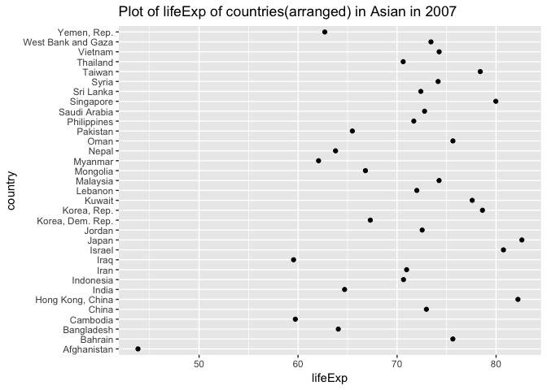
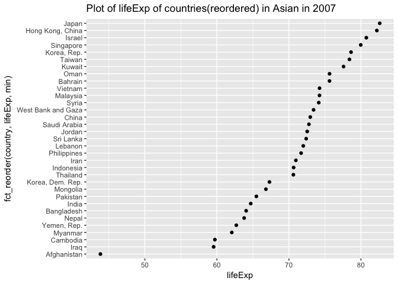
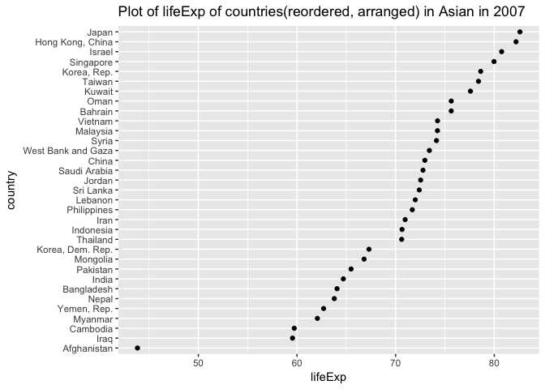

hw05
================
Xinzhe Dong
October 12, 2017

### Abstract

We are going to explore the gapminder data set. We will be practicing data reshaping and join.

#### Table of content

-   [Load data and packages](#load-data-and-packages)
-   [General data reshaping and relationship to aggregation](#general-data-reshaping-and-relationship-to-aggregation)
-   [Join, merge, look up](#join-merge-look-up)

Load data and packages
----------------------

[*Back to the top*](#abstract)

``` r
library(gapminder)
library(tidyverse)
```

    ## Loading tidyverse: ggplot2
    ## Loading tidyverse: tibble
    ## Loading tidyverse: tidyr
    ## Loading tidyverse: readr
    ## Loading tidyverse: purrr
    ## Loading tidyverse: dplyr

    ## Conflicts with tidy packages ----------------------------------------------

    ## filter(): dplyr, stats
    ## lag():    dplyr, stats

``` r
library(knitr)
library(kableExtra)
library(ggplot2)
library(forcats)
library(pander)
```

Factor management

Get to know your factor before you start touching it!

``` r
fct_count(gapminder$continent)
```

    ## # A tibble: 5 x 2
    ##          f     n
    ##     <fctr> <int>
    ## 1   Africa   624
    ## 2 Americas   300
    ## 3     Asia   396
    ## 4   Europe   360
    ## 5  Oceania    24

Drop all the rows corresponding to "Oceania".

``` r
h_gap <- gapminder %>%
  filter(continent != "Oceania")

fct_count(h_gap$continent)
```

    ## # A tibble: 5 x 2
    ##          f     n
    ##     <fctr> <int>
    ## 1   Africa   624
    ## 2 Americas   300
    ## 3     Asia   396
    ## 4   Europe   360
    ## 5  Oceania     0

``` r
nlevels(h_gap$continent)
```

    ## [1] 5

We dropped 24 rows associated with "Oceania". However, the levels of the continent factor itself do not change. "Oceania" is still a level of "continent".

Dropping "Oceania" level.

``` r
h_gap_dropped <- h_gap %>% 
  droplevels()
fct_count(h_gap_dropped$continent)
```

    ## # A tibble: 4 x 2
    ##          f     n
    ##     <fctr> <int>
    ## 1   Africa   624
    ## 2 Americas   300
    ## 3     Asia   396
    ## 4   Europe   360

``` r
nlevels(h_gap_dropped$continent)
```

    ## [1] 4

Now, we dropped 24 rows associated with "Oceania". Additionally, we also dropped the level "Oceania" of the factor "continent".

Change order of the levels

Reorder Gapminder continents by lifeExp

``` r
## order continent according to minimum life exp
fct_reorder(h_gap_dropped$continent, h_gap_dropped$lifeExp, min) %>% 
  levels() %>% head()
```

    ## [1] "Africa"   "Asia"     "Americas" "Europe"

``` r
h_gap_dropped$continent<-fct_reorder(h_gap_dropped$continent, h_gap_dropped$lifeExp, min)

h_gap_dropped%>%
  group_by(continent)%>%
  summarise(min(lifeExp))%>%
  kable()
```

| continent |  min(lifeExp)|
|:----------|-------------:|
| Africa    |        23.599|
| Asia      |        28.801|
| Americas  |        37.579|
| Europe    |        43.585|

Common part: **While you’re here, practice writing to file and reading back in (see next section).**

``` r
write_csv(h_gap_dropped, "h_gap_dropped.csv")
read_csv("h_gap_dropped.csv")
```

    ## Parsed with column specification:
    ## cols(
    ##   country = col_character(),
    ##   continent = col_character(),
    ##   year = col_integer(),
    ##   lifeExp = col_double(),
    ##   pop = col_integer(),
    ##   gdpPercap = col_double()
    ## )

    ## # A tibble: 1,680 x 6
    ##        country continent  year lifeExp      pop gdpPercap
    ##          <chr>     <chr> <int>   <dbl>    <int>     <dbl>
    ##  1 Afghanistan      Asia  1952  28.801  8425333  779.4453
    ##  2 Afghanistan      Asia  1957  30.332  9240934  820.8530
    ##  3 Afghanistan      Asia  1962  31.997 10267083  853.1007
    ##  4 Afghanistan      Asia  1967  34.020 11537966  836.1971
    ##  5 Afghanistan      Asia  1972  36.088 13079460  739.9811
    ##  6 Afghanistan      Asia  1977  38.438 14880372  786.1134
    ##  7 Afghanistan      Asia  1982  39.854 12881816  978.0114
    ##  8 Afghanistan      Asia  1987  40.822 13867957  852.3959
    ##  9 Afghanistan      Asia  1992  41.674 16317921  649.3414
    ## 10 Afghanistan      Asia  1997  41.763 22227415  635.3414
    ## # ... with 1,670 more rows

**Characterize the (derived) data before and after your factor re-leveling.**

Explore the effects of arrange().

``` r
gap_asia_2007 <- gapminder %>% filter(year == 2007, continent == "Asia")
# unarranged, reordered
ggplot(gap_asia_2007, aes(x = lifeExp, y = country)) + geom_point() +
        labs(title= "Plot of lifeExp of countries in Asian in 2007") 
```


``` r
# arranged
gap_asia_2007%>%
  arrange(country, lifeExp)%>%
    ggplot(aes(x = lifeExp, y = country)) + geom_point() +
        labs(title= "Plot of lifeExp of countries(arranged) in Asian in 2007") 
```



``` r
# reordered
ggplot(gap_asia_2007, aes(x = lifeExp, y = fct_reorder(country, lifeExp, min))) +
  geom_point() + labs(title= "Plot of lifeExp of countries(reordered) in Asian in 2007") 
```



``` r
# first reordered, then arranged
gap_asia_2007%>%
  mutate(country=fct_reorder(country, lifeExp, min))%>%
  arrange(country, lifeExp)%>%
    ggplot(aes(x = lifeExp, y = country)) + geom_point() +
        labs(title= "Plot of lifeExp of countries(reordered, arranged) in Asian in 2007") 
```



**Note**:

-   Merely arranging the data has no effect on a figure.
-   Reordered factor levels makes plots much better.

Explore the effects of reordering a factor and factor reordering coupled with arrange(). Especially, what effect does this have on a figure? These explorations should involve the data, the factor levels, and some figures.
