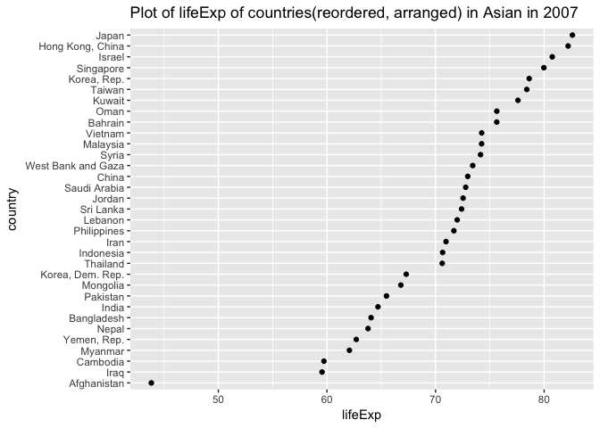

hw05
================
Xinzhe Dong
October 12, 2017

### Abstract

We are going to explore the gapminder data set. We will be practicing data reshaping and join.

#### Table of content

-   [Load data and packages](#load-data-and-packages)
-   [Factor management](#factor-management)
-   [File I/O](#file-io)
-   [Visualization design](#visualization-design)
-   [Writing figures to file](#writing-figures-to-file)
-   [But I want to do more!](#but-i-want-to-do-more)

Load data and packages
----------------------

[*Back to the top*](#abstract)

``` r
library(gapminder)
library(tidyverse)
```

    ## Loading tidyverse: ggplot2
    ## Loading tidyverse: tibble
    ## Loading tidyverse: tidyr
    ## Loading tidyverse: readr
    ## Loading tidyverse: purrr
    ## Loading tidyverse: dplyr

    ## Conflicts with tidy packages ----------------------------------------------

    ## filter(): dplyr, stats
    ## lag():    dplyr, stats

``` r
library(knitr)
library(kableExtra)
library(ggplot2)
library(forcats)
library(pander)
```

Factor management
-----------------

[*Back to the top*](#abstract)

Get to know your factor before you start touching it!

``` r
fct_count(gapminder$continent)
```

    ## # A tibble: 5 x 2
    ##          f     n
    ##     <fctr> <int>
    ## 1   Africa   624
    ## 2 Americas   300
    ## 3     Asia   396
    ## 4   Europe   360
    ## 5  Oceania    24

Drop all the rows corresponding to "Oceania".

``` r
h_gap <- gapminder %>%
  filter(continent != "Oceania")

fct_count(h_gap$continent)
```

    ## # A tibble: 5 x 2
    ##          f     n
    ##     <fctr> <int>
    ## 1   Africa   624
    ## 2 Americas   300
    ## 3     Asia   396
    ## 4   Europe   360
    ## 5  Oceania     0

``` r
nlevels(h_gap$continent)
```

    ## [1] 5

We dropped 24 rows associated with "Oceania". However, the levels of the continent factor itself do not change. "Oceania" is still a level of "continent".

Dropping "Oceania" level.

``` r
h_gap_dropped <- h_gap %>% 
  droplevels()
fct_count(h_gap_dropped$continent)
```

    ## # A tibble: 4 x 2
    ##          f     n
    ##     <fctr> <int>
    ## 1   Africa   624
    ## 2 Americas   300
    ## 3     Asia   396
    ## 4   Europe   360

``` r
nlevels(h_gap_dropped$continent)
```

    ## [1] 4

Now, we dropped 24 rows associated with "Oceania". Additionally, we also dropped the level "Oceania" of the factor "continent".

Change order of the levels

Reorder Gapminder continents by lifeExp

``` r
## order continent according to minimum life exp
fct_reorder(h_gap_dropped$continent, h_gap_dropped$lifeExp, min) %>% 
  levels() %>% head()
```

    ## [1] "Africa"   "Asia"     "Americas" "Europe"

``` r
h_gap_dropped$continent<-fct_reorder(h_gap_dropped$continent, h_gap_dropped$lifeExp, min)

h_gap_dropped%>%
  group_by(continent)%>%
  summarise(min(lifeExp))%>%
  kable()
```

| continent |  min(lifeExp)|
|:----------|-------------:|
| Africa    |        23.599|
| Asia      |        28.801|
| Americas  |        37.579|
| Europe    |        43.585|

Common part: **While you’re here, practice writing to file and reading back in (see next section).**

**Characterize the (derived) data before and after your factor re-leveling.**

Explore the effects of arrange().

``` r
gap_asia_2007 <- gapminder %>% filter(year == 2007, continent == "Asia")
# unarranged, reordered
ggplot(gap_asia_2007, aes(x = lifeExp, y = country)) + geom_point() +
        labs(title= "Plot of lifeExp of countries in Asian in 2007") 
```


``` r
# arranged
gap_asia_2007%>%
  arrange(country, lifeExp)%>%
    ggplot(aes(x = lifeExp, y = country)) + geom_point() +
        labs(title= "Plot of lifeExp of countries(arranged) in Asian in 2007") 
```


``` r
# reordered
ggplot(gap_asia_2007, aes(x = lifeExp, y = fct_reorder(country, lifeExp, min))) +
  geom_point() + labs(title= "Plot of lifeExp of countries(reordered) in Asian in 2007") 
```


``` r
# first reordered, then arranged
gap_asia_2007%>%
  mutate(country=fct_reorder(country, lifeExp, min))%>%
  arrange(country, lifeExp)%>%
    ggplot(aes(x = lifeExp, y = country)) + geom_point() +
        labs(title= "Plot of lifeExp of countries(reordered, arranged) in Asian in 2007") 
```



**Note**:

-   Merely arranging the data has no effect on a figure.
-   Reordered factor levels makes plots much better.

File I/O
--------

[*Back to the top*](#abstract)

``` r
write_csv(h_gap_dropped, "h_gap_dropped.csv")
h_gap_dropped_csv<-read_csv("h_gap_dropped.csv")
```

    ## Parsed with column specification:
    ## cols(
    ##   country = col_character(),
    ##   continent = col_character(),
    ##   year = col_integer(),
    ##   lifeExp = col_double(),
    ##   pop = col_integer(),
    ##   gdpPercap = col_double()
    ## )

``` r
h_gap_dropped_csv%>%
  group_by(continent)%>%
  summarise(min(lifeExp))%>%
  kable()
```

| continent |  min(lifeExp)|
|:----------|-------------:|
| Africa    |        23.599|
| Americas  |        37.579|
| Asia      |        28.801|
| Europe    |        43.585|

We can tell that the order of continents changed. We ordered continent according to minimum life expectancy in the previous section. However, after `write_csv()`/`read_csv()`, the levels of the factor continent again become alphabetically ordered.

``` r
saveRDS(h_gap_dropped, "h_gap_dropped2.csv")
h_gap_dropped_csv2<-readRDS("h_gap_dropped2.csv")

h_gap_dropped_csv2%>%
  group_by(continent)%>%
  summarise(min(lifeExp))%>%
  kable()
```

| continent |  min(lifeExp)|
|:----------|-------------:|
| Africa    |        23.599|
| Asia      |        28.801|
| Americas  |        37.579|
| Europe    |        43.585|

`saveRDS()` and `readRDS()` preserve our work before! The reordered levels are preserved.

Visualization design
--------------------

[*Back to the top*](#abstract)

Remake at least one figure or create a new one, in light of something you learned in the recent class meetings about visualization design and color. Maybe juxtapose your first attempt and what you obtained after some time spent working on it. Reflect on the differences. If using Gapminder, you can use the country or continent color scheme that ships with Gapminder.

``` r
p1 <- ggplot(data = gapminder) + 
  geom_point(mapping = aes(x = year, y = lifeExp))

p2 <- ggplot(data = gapminder) + 
  geom_point(mapping = aes(x = year, y = lifeExp,color=continent)) + 
  facet_wrap(~ continent, nrow = 2) + 
        labs(title= "Plot of life expectancy over time on different continents") 

p3 <- p2 + theme_bw() +
  theme(strip.background = element_rect(fill="orange"),
          axis.title = element_text(size=14),
          strip.text = element_text(size=14, face="bold"))
```

Writing figures to file
-----------------------

[*Back to the top*](#abstract)

Use ggsave() to explicitly save a plot to file.

``` r
ggsave(filename="Plot of life expectancy over time on different continents",
       plot=p3,device =  "png",width = 8, height = 8)
```

**Note**: Explicit provision of the plot object p is not necessary since p3 is the last plot we have. And thie is the only plot we will save to file.

Now we try to load the plot we just saved to file.

[Plot of life expectancy over time on different continents](/Users/hannahdong/Desktop/Stat545/STAT545-hw-Dong-Xinzhe/hw05/Plot%20of%20life%20expectancy%20over%20time%20on%20different%20continents)

But I want to do more!
----------------------

[*Back to the top*](#abstract)
