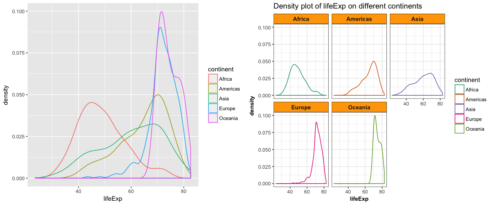
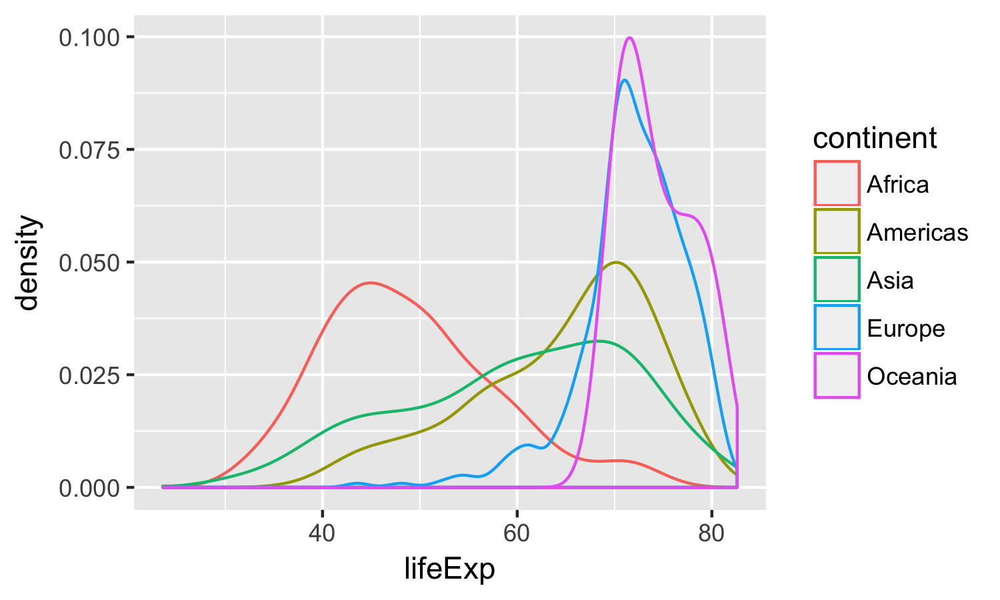

hw05
================
Xinzhe Dong
October 12, 2017

### Abstract

We are going to explore the gapminder data set, including:

-   Reorder a factor using the `forcats` package, and explore its effects on figures
-   Improve a figure made previously, implement visualization design principles
-   Write some data to file and load it back into R using `write_csv()`/`read_csv()`, and `saveRDS()`/`readRDS()`
-   Writing figures to file using `ggsave()`

#### Table of content

-   [Load data and packages](#load-data-and-packages)
-   [Factor management](#factor-management)
-   [File I/O](#file-io)
-   [Visualization design](#visualization-design)
-   [Writing figures to file](#writing-figures-to-file)
-   [But I want to do more!](#but-i-want-to-do-more)

Load data and packages
----------------------

[*Back to the top*](#abstract)

``` r
library(gapminder)
library(tidyverse)
library(knitr)
library(kableExtra)
library(ggplot2)
library(forcats)
library(pander)
library(RColorBrewer)
```

Factor management
-----------------

[*Back to the top*](#abstract)

**Gapminder version:**

**(1)** Get to know the factor before start touching it!

``` r
fct_count(gapminder$continent)%>%
  kable()
```

| f          |                                                                                n|
|:-----------|--------------------------------------------------------------------------------:|
| Africa     |                                                                              624|
| Americas   |                                                                              300|
| Asia       |                                                                              396|
| Europe     |                                                                              360|
| Oceania    |                                                                               24|
| The factor |  "continent" has 5 levels: *Africa*, *Americas*, *Asia*, *Europe* and *Oceania*.|

**(2)** Drop all the rows corresponding to "Oceania".

``` r
h_gap <- gapminder %>%
  filter(continent != "Oceania")

fct_count(h_gap$continent)%>%
  kable()
```

| f        |    n|
|:---------|----:|
| Africa   |  624|
| Americas |  300|
| Asia     |  396|
| Europe   |  360|
| Oceania  |    0|

``` r
nlevels(h_gap$continent)
```

    ## [1] 5

We dropped 24 rows associated with "Oceania". However, the levels of the "continent" factor itself do not change. "Oceania" is still a level of "continent".

**(3)** Dropping "Oceania" level.

``` r
h_gap_dropped <- h_gap %>% 
  droplevels()

fct_count(h_gap_dropped$continent)%>%
  kable()
```

| f        |    n|
|:---------|----:|
| Africa   |  624|
| Americas |  300|
| Asia     |  396|
| Europe   |  360|

``` r
nlevels(h_gap_dropped$continent)
```

    ## [1] 4

Now, we dropped 24 rows associated with "Oceania". Additionally, we also dropped the level "Oceania" of the factor "continent".

**(4)** Change order of the levels: reorder Gapminder continents by minimum of lifeExp.

``` r
## order the factor continent according to minimum life exp
h_gap_dropped$continent<-fct_reorder(h_gap_dropped$continent, h_gap_dropped$lifeExp, min)

## let's check if the reorder works
h_gap_dropped%>%
  group_by(continent)%>%
  summarise(min(lifeExp))%>%
  kable()
```

| continent |  min(lifeExp)|
|:----------|-------------:|
| Africa    |        23.599|
| Asia      |        28.801|
| Americas  |        37.579|
| Europe    |        43.585|

**Common part:**

**(1)** Practice writing data to file and reading back in (see next section).

**(2)** Explore the effects of `arrange()` and `reorder()` on plots.

``` r
gap_asia_2007 <- gapminder %>% filter(year == 2007, continent == "Asia")
# unarranged, unreordered data
ggplot(gap_asia_2007, aes(x = lifeExp, y = country)) + geom_point() +
        labs(title= "Plot of lifeExp of countries in Asian in 2007") 
```


**a.** Arrange the data based on life expectancy.

``` r
gap_asia_2007%>%
  arrange(lifeExp)%>%
  kable("html",caption="Data of Asia in 2007(arranged)")%>%
    kable_styling(bootstrap_options = c("striped", "hover", "condensed", "responsive"))
```

<table class="table table-striped table-hover table-condensed table-responsive" style="margin-left: auto; margin-right: auto;">
<caption>
Data of Asia in 2007(arranged)
</caption>
<thead>
<tr>
<th style="text-align:left;">
country
</th>
<th style="text-align:left;">
continent
</th>
<th style="text-align:right;">
year
</th>
<th style="text-align:right;">
lifeExp
</th>
<th style="text-align:right;">
pop
</th>
<th style="text-align:right;">
gdpPercap
</th>
</tr>
</thead>
<tbody>
<tr>
<td style="text-align:left;">
Afghanistan
</td>
<td style="text-align:left;">
Asia
</td>
<td style="text-align:right;">
2007
</td>
<td style="text-align:right;">
43.828
</td>
<td style="text-align:right;">
31889923
</td>
<td style="text-align:right;">
974.5803
</td>
</tr>
<tr>
<td style="text-align:left;">
Iraq
</td>
<td style="text-align:left;">
Asia
</td>
<td style="text-align:right;">
2007
</td>
<td style="text-align:right;">
59.545
</td>
<td style="text-align:right;">
27499638
</td>
<td style="text-align:right;">
4471.0619
</td>
</tr>
<tr>
<td style="text-align:left;">
Cambodia
</td>
<td style="text-align:left;">
Asia
</td>
<td style="text-align:right;">
2007
</td>
<td style="text-align:right;">
59.723
</td>
<td style="text-align:right;">
14131858
</td>
<td style="text-align:right;">
1713.7787
</td>
</tr>
<tr>
<td style="text-align:left;">
Myanmar
</td>
<td style="text-align:left;">
Asia
</td>
<td style="text-align:right;">
2007
</td>
<td style="text-align:right;">
62.069
</td>
<td style="text-align:right;">
47761980
</td>
<td style="text-align:right;">
944.0000
</td>
</tr>
<tr>
<td style="text-align:left;">
Yemen, Rep.
</td>
<td style="text-align:left;">
Asia
</td>
<td style="text-align:right;">
2007
</td>
<td style="text-align:right;">
62.698
</td>
<td style="text-align:right;">
22211743
</td>
<td style="text-align:right;">
2280.7699
</td>
</tr>
<tr>
<td style="text-align:left;">
Nepal
</td>
<td style="text-align:left;">
Asia
</td>
<td style="text-align:right;">
2007
</td>
<td style="text-align:right;">
63.785
</td>
<td style="text-align:right;">
28901790
</td>
<td style="text-align:right;">
1091.3598
</td>
</tr>
<tr>
<td style="text-align:left;">
Bangladesh
</td>
<td style="text-align:left;">
Asia
</td>
<td style="text-align:right;">
2007
</td>
<td style="text-align:right;">
64.062
</td>
<td style="text-align:right;">
150448339
</td>
<td style="text-align:right;">
1391.2538
</td>
</tr>
<tr>
<td style="text-align:left;">
India
</td>
<td style="text-align:left;">
Asia
</td>
<td style="text-align:right;">
2007
</td>
<td style="text-align:right;">
64.698
</td>
<td style="text-align:right;">
1110396331
</td>
<td style="text-align:right;">
2452.2104
</td>
</tr>
<tr>
<td style="text-align:left;">
Pakistan
</td>
<td style="text-align:left;">
Asia
</td>
<td style="text-align:right;">
2007
</td>
<td style="text-align:right;">
65.483
</td>
<td style="text-align:right;">
169270617
</td>
<td style="text-align:right;">
2605.9476
</td>
</tr>
<tr>
<td style="text-align:left;">
Mongolia
</td>
<td style="text-align:left;">
Asia
</td>
<td style="text-align:right;">
2007
</td>
<td style="text-align:right;">
66.803
</td>
<td style="text-align:right;">
2874127
</td>
<td style="text-align:right;">
3095.7723
</td>
</tr>
<tr>
<td style="text-align:left;">
Korea, Dem. Rep.
</td>
<td style="text-align:left;">
Asia
</td>
<td style="text-align:right;">
2007
</td>
<td style="text-align:right;">
67.297
</td>
<td style="text-align:right;">
23301725
</td>
<td style="text-align:right;">
1593.0655
</td>
</tr>
<tr>
<td style="text-align:left;">
Thailand
</td>
<td style="text-align:left;">
Asia
</td>
<td style="text-align:right;">
2007
</td>
<td style="text-align:right;">
70.616
</td>
<td style="text-align:right;">
65068149
</td>
<td style="text-align:right;">
7458.3963
</td>
</tr>
<tr>
<td style="text-align:left;">
Indonesia
</td>
<td style="text-align:left;">
Asia
</td>
<td style="text-align:right;">
2007
</td>
<td style="text-align:right;">
70.650
</td>
<td style="text-align:right;">
223547000
</td>
<td style="text-align:right;">
3540.6516
</td>
</tr>
<tr>
<td style="text-align:left;">
Iran
</td>
<td style="text-align:left;">
Asia
</td>
<td style="text-align:right;">
2007
</td>
<td style="text-align:right;">
70.964
</td>
<td style="text-align:right;">
69453570
</td>
<td style="text-align:right;">
11605.7145
</td>
</tr>
<tr>
<td style="text-align:left;">
Philippines
</td>
<td style="text-align:left;">
Asia
</td>
<td style="text-align:right;">
2007
</td>
<td style="text-align:right;">
71.688
</td>
<td style="text-align:right;">
91077287
</td>
<td style="text-align:right;">
3190.4810
</td>
</tr>
<tr>
<td style="text-align:left;">
Lebanon
</td>
<td style="text-align:left;">
Asia
</td>
<td style="text-align:right;">
2007
</td>
<td style="text-align:right;">
71.993
</td>
<td style="text-align:right;">
3921278
</td>
<td style="text-align:right;">
10461.0587
</td>
</tr>
<tr>
<td style="text-align:left;">
Sri Lanka
</td>
<td style="text-align:left;">
Asia
</td>
<td style="text-align:right;">
2007
</td>
<td style="text-align:right;">
72.396
</td>
<td style="text-align:right;">
20378239
</td>
<td style="text-align:right;">
3970.0954
</td>
</tr>
<tr>
<td style="text-align:left;">
Jordan
</td>
<td style="text-align:left;">
Asia
</td>
<td style="text-align:right;">
2007
</td>
<td style="text-align:right;">
72.535
</td>
<td style="text-align:right;">
6053193
</td>
<td style="text-align:right;">
4519.4612
</td>
</tr>
<tr>
<td style="text-align:left;">
Saudi Arabia
</td>
<td style="text-align:left;">
Asia
</td>
<td style="text-align:right;">
2007
</td>
<td style="text-align:right;">
72.777
</td>
<td style="text-align:right;">
27601038
</td>
<td style="text-align:right;">
21654.8319
</td>
</tr>
<tr>
<td style="text-align:left;">
China
</td>
<td style="text-align:left;">
Asia
</td>
<td style="text-align:right;">
2007
</td>
<td style="text-align:right;">
72.961
</td>
<td style="text-align:right;">
1318683096
</td>
<td style="text-align:right;">
4959.1149
</td>
</tr>
<tr>
<td style="text-align:left;">
West Bank and Gaza
</td>
<td style="text-align:left;">
Asia
</td>
<td style="text-align:right;">
2007
</td>
<td style="text-align:right;">
73.422
</td>
<td style="text-align:right;">
4018332
</td>
<td style="text-align:right;">
3025.3498
</td>
</tr>
<tr>
<td style="text-align:left;">
Syria
</td>
<td style="text-align:left;">
Asia
</td>
<td style="text-align:right;">
2007
</td>
<td style="text-align:right;">
74.143
</td>
<td style="text-align:right;">
19314747
</td>
<td style="text-align:right;">
4184.5481
</td>
</tr>
<tr>
<td style="text-align:left;">
Malaysia
</td>
<td style="text-align:left;">
Asia
</td>
<td style="text-align:right;">
2007
</td>
<td style="text-align:right;">
74.241
</td>
<td style="text-align:right;">
24821286
</td>
<td style="text-align:right;">
12451.6558
</td>
</tr>
<tr>
<td style="text-align:left;">
Vietnam
</td>
<td style="text-align:left;">
Asia
</td>
<td style="text-align:right;">
2007
</td>
<td style="text-align:right;">
74.249
</td>
<td style="text-align:right;">
85262356
</td>
<td style="text-align:right;">
2441.5764
</td>
</tr>
<tr>
<td style="text-align:left;">
Bahrain
</td>
<td style="text-align:left;">
Asia
</td>
<td style="text-align:right;">
2007
</td>
<td style="text-align:right;">
75.635
</td>
<td style="text-align:right;">
708573
</td>
<td style="text-align:right;">
29796.0483
</td>
</tr>
<tr>
<td style="text-align:left;">
Oman
</td>
<td style="text-align:left;">
Asia
</td>
<td style="text-align:right;">
2007
</td>
<td style="text-align:right;">
75.640
</td>
<td style="text-align:right;">
3204897
</td>
<td style="text-align:right;">
22316.1929
</td>
</tr>
<tr>
<td style="text-align:left;">
Kuwait
</td>
<td style="text-align:left;">
Asia
</td>
<td style="text-align:right;">
2007
</td>
<td style="text-align:right;">
77.588
</td>
<td style="text-align:right;">
2505559
</td>
<td style="text-align:right;">
47306.9898
</td>
</tr>
<tr>
<td style="text-align:left;">
Taiwan
</td>
<td style="text-align:left;">
Asia
</td>
<td style="text-align:right;">
2007
</td>
<td style="text-align:right;">
78.400
</td>
<td style="text-align:right;">
23174294
</td>
<td style="text-align:right;">
28718.2768
</td>
</tr>
<tr>
<td style="text-align:left;">
Korea, Rep.
</td>
<td style="text-align:left;">
Asia
</td>
<td style="text-align:right;">
2007
</td>
<td style="text-align:right;">
78.623
</td>
<td style="text-align:right;">
49044790
</td>
<td style="text-align:right;">
23348.1397
</td>
</tr>
<tr>
<td style="text-align:left;">
Singapore
</td>
<td style="text-align:left;">
Asia
</td>
<td style="text-align:right;">
2007
</td>
<td style="text-align:right;">
79.972
</td>
<td style="text-align:right;">
4553009
</td>
<td style="text-align:right;">
47143.1796
</td>
</tr>
<tr>
<td style="text-align:left;">
Israel
</td>
<td style="text-align:left;">
Asia
</td>
<td style="text-align:right;">
2007
</td>
<td style="text-align:right;">
80.745
</td>
<td style="text-align:right;">
6426679
</td>
<td style="text-align:right;">
25523.2771
</td>
</tr>
<tr>
<td style="text-align:left;">
Hong Kong, China
</td>
<td style="text-align:left;">
Asia
</td>
<td style="text-align:right;">
2007
</td>
<td style="text-align:right;">
82.208
</td>
<td style="text-align:right;">
6980412
</td>
<td style="text-align:right;">
39724.9787
</td>
</tr>
<tr>
<td style="text-align:left;">
Japan
</td>
<td style="text-align:left;">
Asia
</td>
<td style="text-align:right;">
2007
</td>
<td style="text-align:right;">
82.603
</td>
<td style="text-align:right;">
127467972
</td>
<td style="text-align:right;">
31656.0681
</td>
</tr>
</tbody>
</table>
See if the arrange has effect on plots.

``` r
gap_asia_2007%>%
  arrange(lifeExp)%>%
    ggplot(aes(x = lifeExp, y = country)) + geom_point() +
        labs(title= "Plot of lifeExp of countries(arranged) in Asian in 2007") 
```


**b.** Reorder the countries based on life expectancy.

``` r
fct_reorder(gap_asia_2007$country, gap_asia_2007$lifeExp) %>% 
  levels() %>% head()
```

    ## [1] "Afghanistan" "Iraq"        "Cambodia"    "Myanmar"     "Yemen, Rep."
    ## [6] "Nepal"

See if the reorder has effect on plots.

``` r
ggplot(gap_asia_2007, aes(x = lifeExp, y = fct_reorder(country, lifeExp))) +
  geom_point() + labs(title= "Plot of lifeExp of countries(reordered) in Asian in 2007") 
```


**c.** First reorder the countries based on life expectancy, then arranged the data based on life expectancy.

``` r
gap_asia_2007%>%
  mutate(country=fct_reorder(country, lifeExp))%>%
  arrange(lifeExp)%>%
  kable("html",caption="Data of Asia in 2007(reordered and arranged)")%>%
    kable_styling(bootstrap_options = c("striped", "hover", "condensed", "responsive"))
```

<table class="table table-striped table-hover table-condensed table-responsive" style="margin-left: auto; margin-right: auto;">
<caption>
Data of Asia in 2007(reordered and arranged)
</caption>
<thead>
<tr>
<th style="text-align:left;">
country
</th>
<th style="text-align:left;">
continent
</th>
<th style="text-align:right;">
year
</th>
<th style="text-align:right;">
lifeExp
</th>
<th style="text-align:right;">
pop
</th>
<th style="text-align:right;">
gdpPercap
</th>
</tr>
</thead>
<tbody>
<tr>
<td style="text-align:left;">
Afghanistan
</td>
<td style="text-align:left;">
Asia
</td>
<td style="text-align:right;">
2007
</td>
<td style="text-align:right;">
43.828
</td>
<td style="text-align:right;">
31889923
</td>
<td style="text-align:right;">
974.5803
</td>
</tr>
<tr>
<td style="text-align:left;">
Iraq
</td>
<td style="text-align:left;">
Asia
</td>
<td style="text-align:right;">
2007
</td>
<td style="text-align:right;">
59.545
</td>
<td style="text-align:right;">
27499638
</td>
<td style="text-align:right;">
4471.0619
</td>
</tr>
<tr>
<td style="text-align:left;">
Cambodia
</td>
<td style="text-align:left;">
Asia
</td>
<td style="text-align:right;">
2007
</td>
<td style="text-align:right;">
59.723
</td>
<td style="text-align:right;">
14131858
</td>
<td style="text-align:right;">
1713.7787
</td>
</tr>
<tr>
<td style="text-align:left;">
Myanmar
</td>
<td style="text-align:left;">
Asia
</td>
<td style="text-align:right;">
2007
</td>
<td style="text-align:right;">
62.069
</td>
<td style="text-align:right;">
47761980
</td>
<td style="text-align:right;">
944.0000
</td>
</tr>
<tr>
<td style="text-align:left;">
Yemen, Rep.
</td>
<td style="text-align:left;">
Asia
</td>
<td style="text-align:right;">
2007
</td>
<td style="text-align:right;">
62.698
</td>
<td style="text-align:right;">
22211743
</td>
<td style="text-align:right;">
2280.7699
</td>
</tr>
<tr>
<td style="text-align:left;">
Nepal
</td>
<td style="text-align:left;">
Asia
</td>
<td style="text-align:right;">
2007
</td>
<td style="text-align:right;">
63.785
</td>
<td style="text-align:right;">
28901790
</td>
<td style="text-align:right;">
1091.3598
</td>
</tr>
<tr>
<td style="text-align:left;">
Bangladesh
</td>
<td style="text-align:left;">
Asia
</td>
<td style="text-align:right;">
2007
</td>
<td style="text-align:right;">
64.062
</td>
<td style="text-align:right;">
150448339
</td>
<td style="text-align:right;">
1391.2538
</td>
</tr>
<tr>
<td style="text-align:left;">
India
</td>
<td style="text-align:left;">
Asia
</td>
<td style="text-align:right;">
2007
</td>
<td style="text-align:right;">
64.698
</td>
<td style="text-align:right;">
1110396331
</td>
<td style="text-align:right;">
2452.2104
</td>
</tr>
<tr>
<td style="text-align:left;">
Pakistan
</td>
<td style="text-align:left;">
Asia
</td>
<td style="text-align:right;">
2007
</td>
<td style="text-align:right;">
65.483
</td>
<td style="text-align:right;">
169270617
</td>
<td style="text-align:right;">
2605.9476
</td>
</tr>
<tr>
<td style="text-align:left;">
Mongolia
</td>
<td style="text-align:left;">
Asia
</td>
<td style="text-align:right;">
2007
</td>
<td style="text-align:right;">
66.803
</td>
<td style="text-align:right;">
2874127
</td>
<td style="text-align:right;">
3095.7723
</td>
</tr>
<tr>
<td style="text-align:left;">
Korea, Dem. Rep.
</td>
<td style="text-align:left;">
Asia
</td>
<td style="text-align:right;">
2007
</td>
<td style="text-align:right;">
67.297
</td>
<td style="text-align:right;">
23301725
</td>
<td style="text-align:right;">
1593.0655
</td>
</tr>
<tr>
<td style="text-align:left;">
Thailand
</td>
<td style="text-align:left;">
Asia
</td>
<td style="text-align:right;">
2007
</td>
<td style="text-align:right;">
70.616
</td>
<td style="text-align:right;">
65068149
</td>
<td style="text-align:right;">
7458.3963
</td>
</tr>
<tr>
<td style="text-align:left;">
Indonesia
</td>
<td style="text-align:left;">
Asia
</td>
<td style="text-align:right;">
2007
</td>
<td style="text-align:right;">
70.650
</td>
<td style="text-align:right;">
223547000
</td>
<td style="text-align:right;">
3540.6516
</td>
</tr>
<tr>
<td style="text-align:left;">
Iran
</td>
<td style="text-align:left;">
Asia
</td>
<td style="text-align:right;">
2007
</td>
<td style="text-align:right;">
70.964
</td>
<td style="text-align:right;">
69453570
</td>
<td style="text-align:right;">
11605.7145
</td>
</tr>
<tr>
<td style="text-align:left;">
Philippines
</td>
<td style="text-align:left;">
Asia
</td>
<td style="text-align:right;">
2007
</td>
<td style="text-align:right;">
71.688
</td>
<td style="text-align:right;">
91077287
</td>
<td style="text-align:right;">
3190.4810
</td>
</tr>
<tr>
<td style="text-align:left;">
Lebanon
</td>
<td style="text-align:left;">
Asia
</td>
<td style="text-align:right;">
2007
</td>
<td style="text-align:right;">
71.993
</td>
<td style="text-align:right;">
3921278
</td>
<td style="text-align:right;">
10461.0587
</td>
</tr>
<tr>
<td style="text-align:left;">
Sri Lanka
</td>
<td style="text-align:left;">
Asia
</td>
<td style="text-align:right;">
2007
</td>
<td style="text-align:right;">
72.396
</td>
<td style="text-align:right;">
20378239
</td>
<td style="text-align:right;">
3970.0954
</td>
</tr>
<tr>
<td style="text-align:left;">
Jordan
</td>
<td style="text-align:left;">
Asia
</td>
<td style="text-align:right;">
2007
</td>
<td style="text-align:right;">
72.535
</td>
<td style="text-align:right;">
6053193
</td>
<td style="text-align:right;">
4519.4612
</td>
</tr>
<tr>
<td style="text-align:left;">
Saudi Arabia
</td>
<td style="text-align:left;">
Asia
</td>
<td style="text-align:right;">
2007
</td>
<td style="text-align:right;">
72.777
</td>
<td style="text-align:right;">
27601038
</td>
<td style="text-align:right;">
21654.8319
</td>
</tr>
<tr>
<td style="text-align:left;">
China
</td>
<td style="text-align:left;">
Asia
</td>
<td style="text-align:right;">
2007
</td>
<td style="text-align:right;">
72.961
</td>
<td style="text-align:right;">
1318683096
</td>
<td style="text-align:right;">
4959.1149
</td>
</tr>
<tr>
<td style="text-align:left;">
West Bank and Gaza
</td>
<td style="text-align:left;">
Asia
</td>
<td style="text-align:right;">
2007
</td>
<td style="text-align:right;">
73.422
</td>
<td style="text-align:right;">
4018332
</td>
<td style="text-align:right;">
3025.3498
</td>
</tr>
<tr>
<td style="text-align:left;">
Syria
</td>
<td style="text-align:left;">
Asia
</td>
<td style="text-align:right;">
2007
</td>
<td style="text-align:right;">
74.143
</td>
<td style="text-align:right;">
19314747
</td>
<td style="text-align:right;">
4184.5481
</td>
</tr>
<tr>
<td style="text-align:left;">
Malaysia
</td>
<td style="text-align:left;">
Asia
</td>
<td style="text-align:right;">
2007
</td>
<td style="text-align:right;">
74.241
</td>
<td style="text-align:right;">
24821286
</td>
<td style="text-align:right;">
12451.6558
</td>
</tr>
<tr>
<td style="text-align:left;">
Vietnam
</td>
<td style="text-align:left;">
Asia
</td>
<td style="text-align:right;">
2007
</td>
<td style="text-align:right;">
74.249
</td>
<td style="text-align:right;">
85262356
</td>
<td style="text-align:right;">
2441.5764
</td>
</tr>
<tr>
<td style="text-align:left;">
Bahrain
</td>
<td style="text-align:left;">
Asia
</td>
<td style="text-align:right;">
2007
</td>
<td style="text-align:right;">
75.635
</td>
<td style="text-align:right;">
708573
</td>
<td style="text-align:right;">
29796.0483
</td>
</tr>
<tr>
<td style="text-align:left;">
Oman
</td>
<td style="text-align:left;">
Asia
</td>
<td style="text-align:right;">
2007
</td>
<td style="text-align:right;">
75.640
</td>
<td style="text-align:right;">
3204897
</td>
<td style="text-align:right;">
22316.1929
</td>
</tr>
<tr>
<td style="text-align:left;">
Kuwait
</td>
<td style="text-align:left;">
Asia
</td>
<td style="text-align:right;">
2007
</td>
<td style="text-align:right;">
77.588
</td>
<td style="text-align:right;">
2505559
</td>
<td style="text-align:right;">
47306.9898
</td>
</tr>
<tr>
<td style="text-align:left;">
Taiwan
</td>
<td style="text-align:left;">
Asia
</td>
<td style="text-align:right;">
2007
</td>
<td style="text-align:right;">
78.400
</td>
<td style="text-align:right;">
23174294
</td>
<td style="text-align:right;">
28718.2768
</td>
</tr>
<tr>
<td style="text-align:left;">
Korea, Rep.
</td>
<td style="text-align:left;">
Asia
</td>
<td style="text-align:right;">
2007
</td>
<td style="text-align:right;">
78.623
</td>
<td style="text-align:right;">
49044790
</td>
<td style="text-align:right;">
23348.1397
</td>
</tr>
<tr>
<td style="text-align:left;">
Singapore
</td>
<td style="text-align:left;">
Asia
</td>
<td style="text-align:right;">
2007
</td>
<td style="text-align:right;">
79.972
</td>
<td style="text-align:right;">
4553009
</td>
<td style="text-align:right;">
47143.1796
</td>
</tr>
<tr>
<td style="text-align:left;">
Israel
</td>
<td style="text-align:left;">
Asia
</td>
<td style="text-align:right;">
2007
</td>
<td style="text-align:right;">
80.745
</td>
<td style="text-align:right;">
6426679
</td>
<td style="text-align:right;">
25523.2771
</td>
</tr>
<tr>
<td style="text-align:left;">
Hong Kong, China
</td>
<td style="text-align:left;">
Asia
</td>
<td style="text-align:right;">
2007
</td>
<td style="text-align:right;">
82.208
</td>
<td style="text-align:right;">
6980412
</td>
<td style="text-align:right;">
39724.9787
</td>
</tr>
<tr>
<td style="text-align:left;">
Japan
</td>
<td style="text-align:left;">
Asia
</td>
<td style="text-align:right;">
2007
</td>
<td style="text-align:right;">
82.603
</td>
<td style="text-align:right;">
127467972
</td>
<td style="text-align:right;">
31656.0681
</td>
</tr>
</tbody>
</table>
See if the reorder and arrange has effect on plots.

``` r
gap_asia_2007%>%
  mutate(country=fct_reorder(country, lifeExp))%>%
  arrange(lifeExp)%>%
    ggplot(aes(x = lifeExp, y = country)) + geom_point() +
        labs(title= "Plot of lifeExp of countries(reordered, arranged) in Asian in 2007") 
```


**Note**:

-   Merely arranging the data has no effect on a figure.
-   Reordered factor levels makes plots much better.

File I/O
--------

[*Back to the top*](#abstract)

**(1)** Experiment with `write_csv()`/`read_csv()`.

``` r
write_csv(h_gap_dropped, "h_gap_dropped.csv")
h_gap_dropped_csv<-read_csv("h_gap_dropped.csv")

h_gap_dropped_csv%>%
  group_by(continent)%>%
  summarise(min(lifeExp))%>%
  kable()
```

| continent |  min(lifeExp)|
|:----------|-------------:|
| Africa    |        23.599|
| Americas  |        37.579|
| Asia      |        28.801|
| Europe    |        43.585|

We can tell that the order of continents changed. We ordered continent according to minimum life expectancy in the previous section. However, after `write_csv()`/`read_csv()`, the levels of the factor continent again become alphabetically ordered.

**(2)** Experiment with `saveRDS()`/`readRDS()`.

``` r
saveRDS(h_gap_dropped, "h_gap_dropped2.csv")
h_gap_dropped_csv2<-readRDS("h_gap_dropped2.csv")

h_gap_dropped_csv2%>%
  group_by(continent)%>%
  summarise(min(lifeExp))%>%
  kable()
```

| continent |  min(lifeExp)|
|:----------|-------------:|
| Africa    |        23.599|
| Asia      |        28.801|
| Americas  |        37.579|
| Europe    |        43.585|

`saveRDS()` and `readRDS()` preserve our work before! The reordered levels are preserved.

Visualization design
--------------------

[*Back to the top*](#abstract)

**(1)** Remake one figure I made in my earlier assignment.

``` r
# a plot from my hw02
p1<- ggplot(gapminder, aes(x = lifeExp, color = continent)) + geom_density()
p1
```


``` r
# Remake the plot with visualization design and color learned in the recent class.
p2<- ggplot(gapminder, aes(x = lifeExp, color = continent)) + geom_density() +
      facet_wrap(~ continent) +
      scale_color_manual(values=brewer.pal(n=5, "Dark2")) +
      labs(title= "Density plot of lifeExp on different continents") +
  
  theme_bw() +
  theme(strip.background = element_rect(fill="orange"),
          axis.title = element_text(size=10,face="bold"),
          strip.text = element_text(size=10, face="bold"))
p2
```


I facetted the density plots wrt continents, I changed the color of the plots by changing the color scheme to "Dark2", I also added a title to my plot, and I changed the theme of the plot.

**(2)** Juxtapose (using the `multiplot()` function) the first attempt and what I obtained after some time spent working on it.

``` r
# Multiple plot function
#
# ggplot objects can be passed in ..., or to plotlist (as a list of ggplot objects)
# - cols:   Number of columns in layout
# - layout: A matrix specifying the layout. If present, 'cols' is ignored.
#
# If the layout is something like matrix(c(1,2,3,3), nrow=2, byrow=TRUE),
# then plot 1 will go in the upper left, 2 will go in the upper right, and
# 3 will go all the way across the bottom.
#
multiplot <- function(..., plotlist=NULL, file, cols=1, layout=NULL) {
  require(grid)

  # Make a list from the ... arguments and plotlist
  plots <- c(list(...), plotlist)

  numPlots = length(plots)

  # If layout is NULL, then use 'cols' to determine layout
  if (is.null(layout)) {
    # Make the panel
    # ncol: Number of columns of plots
    # nrow: Number of rows needed, calculated from # of cols
    layout <- matrix(seq(1, cols * ceiling(numPlots/cols)),
                    ncol = cols, nrow = ceiling(numPlots/cols))
  }

 if (numPlots==1) {
    print(plots[[1]])

  } else {
    # Set up the page
    grid.newpage()
    pushViewport(viewport(layout = grid.layout(nrow(layout), ncol(layout))))

    # Make each plot, in the correct location
    for (i in 1:numPlots) {
      # Get the i,j matrix positions of the regions that contain this subplot
      matchidx <- as.data.frame(which(layout == i, arr.ind = TRUE))

      print(plots[[i]], vp = viewport(layout.pos.row = matchidx$row,
                                      layout.pos.col = matchidx$col))
    }
  }
}


multiplot(p1, p2, cols = 2)
```



Writing figures to file
-----------------------

[*Back to the top*](#abstract)

**(1)** Use ggsave() to explicitly save p2 and p1 to file.

``` r
ggsave("myplot2.png", 
       device =  "png",width = 6, height = 4.5)

ggsave("myplot1.png", plot=p1,
       device =  "png",width = 5, height = 3)
```

**Note**: Explicit provision of the plot object p2 is not necessary since p2 is the last plot displayed. However, it is necessary for p1 because p1 is a plot we made earlier.

**(2)** Now we try to load the plots we just saved to file.

 

But I want to do more!
----------------------

[*Back to the top*](#abstract)

**(1)** Create an excerpt of the Gapminder data, filtered to Canada, China and United States.

``` r
filter_country <- filter(gapminder, country%in% c("Canada","China","United States"))
filter_country%>%
  kable("html",caption="Filtered gapminder")%>%
    kable_styling(bootstrap_options = c("striped", "hover", "condensed", "responsive"))
```

<table class="table table-striped table-hover table-condensed table-responsive" style="margin-left: auto; margin-right: auto;">
<caption>
Filtered gapminder
</caption>
<thead>
<tr>
<th style="text-align:left;">
country
</th>
<th style="text-align:left;">
continent
</th>
<th style="text-align:right;">
year
</th>
<th style="text-align:right;">
lifeExp
</th>
<th style="text-align:right;">
pop
</th>
<th style="text-align:right;">
gdpPercap
</th>
</tr>
</thead>
<tbody>
<tr>
<td style="text-align:left;">
Canada
</td>
<td style="text-align:left;">
Americas
</td>
<td style="text-align:right;">
1952
</td>
<td style="text-align:right;">
68.75000
</td>
<td style="text-align:right;">
14785584
</td>
<td style="text-align:right;">
11367.1611
</td>
</tr>
<tr>
<td style="text-align:left;">
Canada
</td>
<td style="text-align:left;">
Americas
</td>
<td style="text-align:right;">
1957
</td>
<td style="text-align:right;">
69.96000
</td>
<td style="text-align:right;">
17010154
</td>
<td style="text-align:right;">
12489.9501
</td>
</tr>
<tr>
<td style="text-align:left;">
Canada
</td>
<td style="text-align:left;">
Americas
</td>
<td style="text-align:right;">
1962
</td>
<td style="text-align:right;">
71.30000
</td>
<td style="text-align:right;">
18985849
</td>
<td style="text-align:right;">
13462.4855
</td>
</tr>
<tr>
<td style="text-align:left;">
Canada
</td>
<td style="text-align:left;">
Americas
</td>
<td style="text-align:right;">
1967
</td>
<td style="text-align:right;">
72.13000
</td>
<td style="text-align:right;">
20819767
</td>
<td style="text-align:right;">
16076.5880
</td>
</tr>
<tr>
<td style="text-align:left;">
Canada
</td>
<td style="text-align:left;">
Americas
</td>
<td style="text-align:right;">
1972
</td>
<td style="text-align:right;">
72.88000
</td>
<td style="text-align:right;">
22284500
</td>
<td style="text-align:right;">
18970.5709
</td>
</tr>
<tr>
<td style="text-align:left;">
Canada
</td>
<td style="text-align:left;">
Americas
</td>
<td style="text-align:right;">
1977
</td>
<td style="text-align:right;">
74.21000
</td>
<td style="text-align:right;">
23796400
</td>
<td style="text-align:right;">
22090.8831
</td>
</tr>
<tr>
<td style="text-align:left;">
Canada
</td>
<td style="text-align:left;">
Americas
</td>
<td style="text-align:right;">
1982
</td>
<td style="text-align:right;">
75.76000
</td>
<td style="text-align:right;">
25201900
</td>
<td style="text-align:right;">
22898.7921
</td>
</tr>
<tr>
<td style="text-align:left;">
Canada
</td>
<td style="text-align:left;">
Americas
</td>
<td style="text-align:right;">
1987
</td>
<td style="text-align:right;">
76.86000
</td>
<td style="text-align:right;">
26549700
</td>
<td style="text-align:right;">
26626.5150
</td>
</tr>
<tr>
<td style="text-align:left;">
Canada
</td>
<td style="text-align:left;">
Americas
</td>
<td style="text-align:right;">
1992
</td>
<td style="text-align:right;">
77.95000
</td>
<td style="text-align:right;">
28523502
</td>
<td style="text-align:right;">
26342.8843
</td>
</tr>
<tr>
<td style="text-align:left;">
Canada
</td>
<td style="text-align:left;">
Americas
</td>
<td style="text-align:right;">
1997
</td>
<td style="text-align:right;">
78.61000
</td>
<td style="text-align:right;">
30305843
</td>
<td style="text-align:right;">
28954.9259
</td>
</tr>
<tr>
<td style="text-align:left;">
Canada
</td>
<td style="text-align:left;">
Americas
</td>
<td style="text-align:right;">
2002
</td>
<td style="text-align:right;">
79.77000
</td>
<td style="text-align:right;">
31902268
</td>
<td style="text-align:right;">
33328.9651
</td>
</tr>
<tr>
<td style="text-align:left;">
Canada
</td>
<td style="text-align:left;">
Americas
</td>
<td style="text-align:right;">
2007
</td>
<td style="text-align:right;">
80.65300
</td>
<td style="text-align:right;">
33390141
</td>
<td style="text-align:right;">
36319.2350
</td>
</tr>
<tr>
<td style="text-align:left;">
China
</td>
<td style="text-align:left;">
Asia
</td>
<td style="text-align:right;">
1952
</td>
<td style="text-align:right;">
44.00000
</td>
<td style="text-align:right;">
556263527
</td>
<td style="text-align:right;">
400.4486
</td>
</tr>
<tr>
<td style="text-align:left;">
China
</td>
<td style="text-align:left;">
Asia
</td>
<td style="text-align:right;">
1957
</td>
<td style="text-align:right;">
50.54896
</td>
<td style="text-align:right;">
637408000
</td>
<td style="text-align:right;">
575.9870
</td>
</tr>
<tr>
<td style="text-align:left;">
China
</td>
<td style="text-align:left;">
Asia
</td>
<td style="text-align:right;">
1962
</td>
<td style="text-align:right;">
44.50136
</td>
<td style="text-align:right;">
665770000
</td>
<td style="text-align:right;">
487.6740
</td>
</tr>
<tr>
<td style="text-align:left;">
China
</td>
<td style="text-align:left;">
Asia
</td>
<td style="text-align:right;">
1967
</td>
<td style="text-align:right;">
58.38112
</td>
<td style="text-align:right;">
754550000
</td>
<td style="text-align:right;">
612.7057
</td>
</tr>
<tr>
<td style="text-align:left;">
China
</td>
<td style="text-align:left;">
Asia
</td>
<td style="text-align:right;">
1972
</td>
<td style="text-align:right;">
63.11888
</td>
<td style="text-align:right;">
862030000
</td>
<td style="text-align:right;">
676.9001
</td>
</tr>
<tr>
<td style="text-align:left;">
China
</td>
<td style="text-align:left;">
Asia
</td>
<td style="text-align:right;">
1977
</td>
<td style="text-align:right;">
63.96736
</td>
<td style="text-align:right;">
943455000
</td>
<td style="text-align:right;">
741.2375
</td>
</tr>
<tr>
<td style="text-align:left;">
China
</td>
<td style="text-align:left;">
Asia
</td>
<td style="text-align:right;">
1982
</td>
<td style="text-align:right;">
65.52500
</td>
<td style="text-align:right;">
1000281000
</td>
<td style="text-align:right;">
962.4214
</td>
</tr>
<tr>
<td style="text-align:left;">
China
</td>
<td style="text-align:left;">
Asia
</td>
<td style="text-align:right;">
1987
</td>
<td style="text-align:right;">
67.27400
</td>
<td style="text-align:right;">
1084035000
</td>
<td style="text-align:right;">
1378.9040
</td>
</tr>
<tr>
<td style="text-align:left;">
China
</td>
<td style="text-align:left;">
Asia
</td>
<td style="text-align:right;">
1992
</td>
<td style="text-align:right;">
68.69000
</td>
<td style="text-align:right;">
1164970000
</td>
<td style="text-align:right;">
1655.7842
</td>
</tr>
<tr>
<td style="text-align:left;">
China
</td>
<td style="text-align:left;">
Asia
</td>
<td style="text-align:right;">
1997
</td>
<td style="text-align:right;">
70.42600
</td>
<td style="text-align:right;">
1230075000
</td>
<td style="text-align:right;">
2289.2341
</td>
</tr>
<tr>
<td style="text-align:left;">
China
</td>
<td style="text-align:left;">
Asia
</td>
<td style="text-align:right;">
2002
</td>
<td style="text-align:right;">
72.02800
</td>
<td style="text-align:right;">
1280400000
</td>
<td style="text-align:right;">
3119.2809
</td>
</tr>
<tr>
<td style="text-align:left;">
China
</td>
<td style="text-align:left;">
Asia
</td>
<td style="text-align:right;">
2007
</td>
<td style="text-align:right;">
72.96100
</td>
<td style="text-align:right;">
1318683096
</td>
<td style="text-align:right;">
4959.1149
</td>
</tr>
<tr>
<td style="text-align:left;">
United States
</td>
<td style="text-align:left;">
Americas
</td>
<td style="text-align:right;">
1952
</td>
<td style="text-align:right;">
68.44000
</td>
<td style="text-align:right;">
157553000
</td>
<td style="text-align:right;">
13990.4821
</td>
</tr>
<tr>
<td style="text-align:left;">
United States
</td>
<td style="text-align:left;">
Americas
</td>
<td style="text-align:right;">
1957
</td>
<td style="text-align:right;">
69.49000
</td>
<td style="text-align:right;">
171984000
</td>
<td style="text-align:right;">
14847.1271
</td>
</tr>
<tr>
<td style="text-align:left;">
United States
</td>
<td style="text-align:left;">
Americas
</td>
<td style="text-align:right;">
1962
</td>
<td style="text-align:right;">
70.21000
</td>
<td style="text-align:right;">
186538000
</td>
<td style="text-align:right;">
16173.1459
</td>
</tr>
<tr>
<td style="text-align:left;">
United States
</td>
<td style="text-align:left;">
Americas
</td>
<td style="text-align:right;">
1967
</td>
<td style="text-align:right;">
70.76000
</td>
<td style="text-align:right;">
198712000
</td>
<td style="text-align:right;">
19530.3656
</td>
</tr>
<tr>
<td style="text-align:left;">
United States
</td>
<td style="text-align:left;">
Americas
</td>
<td style="text-align:right;">
1972
</td>
<td style="text-align:right;">
71.34000
</td>
<td style="text-align:right;">
209896000
</td>
<td style="text-align:right;">
21806.0359
</td>
</tr>
<tr>
<td style="text-align:left;">
United States
</td>
<td style="text-align:left;">
Americas
</td>
<td style="text-align:right;">
1977
</td>
<td style="text-align:right;">
73.38000
</td>
<td style="text-align:right;">
220239000
</td>
<td style="text-align:right;">
24072.6321
</td>
</tr>
<tr>
<td style="text-align:left;">
United States
</td>
<td style="text-align:left;">
Americas
</td>
<td style="text-align:right;">
1982
</td>
<td style="text-align:right;">
74.65000
</td>
<td style="text-align:right;">
232187835
</td>
<td style="text-align:right;">
25009.5591
</td>
</tr>
<tr>
<td style="text-align:left;">
United States
</td>
<td style="text-align:left;">
Americas
</td>
<td style="text-align:right;">
1987
</td>
<td style="text-align:right;">
75.02000
</td>
<td style="text-align:right;">
242803533
</td>
<td style="text-align:right;">
29884.3504
</td>
</tr>
<tr>
<td style="text-align:left;">
United States
</td>
<td style="text-align:left;">
Americas
</td>
<td style="text-align:right;">
1992
</td>
<td style="text-align:right;">
76.09000
</td>
<td style="text-align:right;">
256894189
</td>
<td style="text-align:right;">
32003.9322
</td>
</tr>
<tr>
<td style="text-align:left;">
United States
</td>
<td style="text-align:left;">
Americas
</td>
<td style="text-align:right;">
1997
</td>
<td style="text-align:right;">
76.81000
</td>
<td style="text-align:right;">
272911760
</td>
<td style="text-align:right;">
35767.4330
</td>
</tr>
<tr>
<td style="text-align:left;">
United States
</td>
<td style="text-align:left;">
Americas
</td>
<td style="text-align:right;">
2002
</td>
<td style="text-align:right;">
77.31000
</td>
<td style="text-align:right;">
287675526
</td>
<td style="text-align:right;">
39097.0995
</td>
</tr>
<tr>
<td style="text-align:left;">
United States
</td>
<td style="text-align:left;">
Americas
</td>
<td style="text-align:right;">
2007
</td>
<td style="text-align:right;">
78.24200
</td>
<td style="text-align:right;">
301139947
</td>
<td style="text-align:right;">
42951.6531
</td>
</tr>
</tbody>
</table>
Now the gapminder dataset is filtered to observations of Canada, China and United States.

**(2)** Create a new factor "sport". By mapping the existing country factor levels to the new levels.

``` r
filter_country_sport<-
filter_country %>%
  mutate(sport = fct_recode(country,
    "hockey"    = "Canada",
    "table tennis"      = "China",
    "basketball" = "United States"
  ))

filter_country_sport%>%
    kable("html",caption="Filtered gapminder with a factor sport added")%>%
    kable_styling(bootstrap_options = c("striped", "hover", "condensed", "responsive"))
```

<table class="table table-striped table-hover table-condensed table-responsive" style="margin-left: auto; margin-right: auto;">
<caption>
Filtered gapminder with a factor sport added
</caption>
<thead>
<tr>
<th style="text-align:left;">
country
</th>
<th style="text-align:left;">
continent
</th>
<th style="text-align:right;">
year
</th>
<th style="text-align:right;">
lifeExp
</th>
<th style="text-align:right;">
pop
</th>
<th style="text-align:right;">
gdpPercap
</th>
<th style="text-align:left;">
sport
</th>
</tr>
</thead>
<tbody>
<tr>
<td style="text-align:left;">
Canada
</td>
<td style="text-align:left;">
Americas
</td>
<td style="text-align:right;">
1952
</td>
<td style="text-align:right;">
68.75000
</td>
<td style="text-align:right;">
14785584
</td>
<td style="text-align:right;">
11367.1611
</td>
<td style="text-align:left;">
hockey
</td>
</tr>
<tr>
<td style="text-align:left;">
Canada
</td>
<td style="text-align:left;">
Americas
</td>
<td style="text-align:right;">
1957
</td>
<td style="text-align:right;">
69.96000
</td>
<td style="text-align:right;">
17010154
</td>
<td style="text-align:right;">
12489.9501
</td>
<td style="text-align:left;">
hockey
</td>
</tr>
<tr>
<td style="text-align:left;">
Canada
</td>
<td style="text-align:left;">
Americas
</td>
<td style="text-align:right;">
1962
</td>
<td style="text-align:right;">
71.30000
</td>
<td style="text-align:right;">
18985849
</td>
<td style="text-align:right;">
13462.4855
</td>
<td style="text-align:left;">
hockey
</td>
</tr>
<tr>
<td style="text-align:left;">
Canada
</td>
<td style="text-align:left;">
Americas
</td>
<td style="text-align:right;">
1967
</td>
<td style="text-align:right;">
72.13000
</td>
<td style="text-align:right;">
20819767
</td>
<td style="text-align:right;">
16076.5880
</td>
<td style="text-align:left;">
hockey
</td>
</tr>
<tr>
<td style="text-align:left;">
Canada
</td>
<td style="text-align:left;">
Americas
</td>
<td style="text-align:right;">
1972
</td>
<td style="text-align:right;">
72.88000
</td>
<td style="text-align:right;">
22284500
</td>
<td style="text-align:right;">
18970.5709
</td>
<td style="text-align:left;">
hockey
</td>
</tr>
<tr>
<td style="text-align:left;">
Canada
</td>
<td style="text-align:left;">
Americas
</td>
<td style="text-align:right;">
1977
</td>
<td style="text-align:right;">
74.21000
</td>
<td style="text-align:right;">
23796400
</td>
<td style="text-align:right;">
22090.8831
</td>
<td style="text-align:left;">
hockey
</td>
</tr>
<tr>
<td style="text-align:left;">
Canada
</td>
<td style="text-align:left;">
Americas
</td>
<td style="text-align:right;">
1982
</td>
<td style="text-align:right;">
75.76000
</td>
<td style="text-align:right;">
25201900
</td>
<td style="text-align:right;">
22898.7921
</td>
<td style="text-align:left;">
hockey
</td>
</tr>
<tr>
<td style="text-align:left;">
Canada
</td>
<td style="text-align:left;">
Americas
</td>
<td style="text-align:right;">
1987
</td>
<td style="text-align:right;">
76.86000
</td>
<td style="text-align:right;">
26549700
</td>
<td style="text-align:right;">
26626.5150
</td>
<td style="text-align:left;">
hockey
</td>
</tr>
<tr>
<td style="text-align:left;">
Canada
</td>
<td style="text-align:left;">
Americas
</td>
<td style="text-align:right;">
1992
</td>
<td style="text-align:right;">
77.95000
</td>
<td style="text-align:right;">
28523502
</td>
<td style="text-align:right;">
26342.8843
</td>
<td style="text-align:left;">
hockey
</td>
</tr>
<tr>
<td style="text-align:left;">
Canada
</td>
<td style="text-align:left;">
Americas
</td>
<td style="text-align:right;">
1997
</td>
<td style="text-align:right;">
78.61000
</td>
<td style="text-align:right;">
30305843
</td>
<td style="text-align:right;">
28954.9259
</td>
<td style="text-align:left;">
hockey
</td>
</tr>
<tr>
<td style="text-align:left;">
Canada
</td>
<td style="text-align:left;">
Americas
</td>
<td style="text-align:right;">
2002
</td>
<td style="text-align:right;">
79.77000
</td>
<td style="text-align:right;">
31902268
</td>
<td style="text-align:right;">
33328.9651
</td>
<td style="text-align:left;">
hockey
</td>
</tr>
<tr>
<td style="text-align:left;">
Canada
</td>
<td style="text-align:left;">
Americas
</td>
<td style="text-align:right;">
2007
</td>
<td style="text-align:right;">
80.65300
</td>
<td style="text-align:right;">
33390141
</td>
<td style="text-align:right;">
36319.2350
</td>
<td style="text-align:left;">
hockey
</td>
</tr>
<tr>
<td style="text-align:left;">
China
</td>
<td style="text-align:left;">
Asia
</td>
<td style="text-align:right;">
1952
</td>
<td style="text-align:right;">
44.00000
</td>
<td style="text-align:right;">
556263527
</td>
<td style="text-align:right;">
400.4486
</td>
<td style="text-align:left;">
table tennis
</td>
</tr>
<tr>
<td style="text-align:left;">
China
</td>
<td style="text-align:left;">
Asia
</td>
<td style="text-align:right;">
1957
</td>
<td style="text-align:right;">
50.54896
</td>
<td style="text-align:right;">
637408000
</td>
<td style="text-align:right;">
575.9870
</td>
<td style="text-align:left;">
table tennis
</td>
</tr>
<tr>
<td style="text-align:left;">
China
</td>
<td style="text-align:left;">
Asia
</td>
<td style="text-align:right;">
1962
</td>
<td style="text-align:right;">
44.50136
</td>
<td style="text-align:right;">
665770000
</td>
<td style="text-align:right;">
487.6740
</td>
<td style="text-align:left;">
table tennis
</td>
</tr>
<tr>
<td style="text-align:left;">
China
</td>
<td style="text-align:left;">
Asia
</td>
<td style="text-align:right;">
1967
</td>
<td style="text-align:right;">
58.38112
</td>
<td style="text-align:right;">
754550000
</td>
<td style="text-align:right;">
612.7057
</td>
<td style="text-align:left;">
table tennis
</td>
</tr>
<tr>
<td style="text-align:left;">
China
</td>
<td style="text-align:left;">
Asia
</td>
<td style="text-align:right;">
1972
</td>
<td style="text-align:right;">
63.11888
</td>
<td style="text-align:right;">
862030000
</td>
<td style="text-align:right;">
676.9001
</td>
<td style="text-align:left;">
table tennis
</td>
</tr>
<tr>
<td style="text-align:left;">
China
</td>
<td style="text-align:left;">
Asia
</td>
<td style="text-align:right;">
1977
</td>
<td style="text-align:right;">
63.96736
</td>
<td style="text-align:right;">
943455000
</td>
<td style="text-align:right;">
741.2375
</td>
<td style="text-align:left;">
table tennis
</td>
</tr>
<tr>
<td style="text-align:left;">
China
</td>
<td style="text-align:left;">
Asia
</td>
<td style="text-align:right;">
1982
</td>
<td style="text-align:right;">
65.52500
</td>
<td style="text-align:right;">
1000281000
</td>
<td style="text-align:right;">
962.4214
</td>
<td style="text-align:left;">
table tennis
</td>
</tr>
<tr>
<td style="text-align:left;">
China
</td>
<td style="text-align:left;">
Asia
</td>
<td style="text-align:right;">
1987
</td>
<td style="text-align:right;">
67.27400
</td>
<td style="text-align:right;">
1084035000
</td>
<td style="text-align:right;">
1378.9040
</td>
<td style="text-align:left;">
table tennis
</td>
</tr>
<tr>
<td style="text-align:left;">
China
</td>
<td style="text-align:left;">
Asia
</td>
<td style="text-align:right;">
1992
</td>
<td style="text-align:right;">
68.69000
</td>
<td style="text-align:right;">
1164970000
</td>
<td style="text-align:right;">
1655.7842
</td>
<td style="text-align:left;">
table tennis
</td>
</tr>
<tr>
<td style="text-align:left;">
China
</td>
<td style="text-align:left;">
Asia
</td>
<td style="text-align:right;">
1997
</td>
<td style="text-align:right;">
70.42600
</td>
<td style="text-align:right;">
1230075000
</td>
<td style="text-align:right;">
2289.2341
</td>
<td style="text-align:left;">
table tennis
</td>
</tr>
<tr>
<td style="text-align:left;">
China
</td>
<td style="text-align:left;">
Asia
</td>
<td style="text-align:right;">
2002
</td>
<td style="text-align:right;">
72.02800
</td>
<td style="text-align:right;">
1280400000
</td>
<td style="text-align:right;">
3119.2809
</td>
<td style="text-align:left;">
table tennis
</td>
</tr>
<tr>
<td style="text-align:left;">
China
</td>
<td style="text-align:left;">
Asia
</td>
<td style="text-align:right;">
2007
</td>
<td style="text-align:right;">
72.96100
</td>
<td style="text-align:right;">
1318683096
</td>
<td style="text-align:right;">
4959.1149
</td>
<td style="text-align:left;">
table tennis
</td>
</tr>
<tr>
<td style="text-align:left;">
United States
</td>
<td style="text-align:left;">
Americas
</td>
<td style="text-align:right;">
1952
</td>
<td style="text-align:right;">
68.44000
</td>
<td style="text-align:right;">
157553000
</td>
<td style="text-align:right;">
13990.4821
</td>
<td style="text-align:left;">
basketball
</td>
</tr>
<tr>
<td style="text-align:left;">
United States
</td>
<td style="text-align:left;">
Americas
</td>
<td style="text-align:right;">
1957
</td>
<td style="text-align:right;">
69.49000
</td>
<td style="text-align:right;">
171984000
</td>
<td style="text-align:right;">
14847.1271
</td>
<td style="text-align:left;">
basketball
</td>
</tr>
<tr>
<td style="text-align:left;">
United States
</td>
<td style="text-align:left;">
Americas
</td>
<td style="text-align:right;">
1962
</td>
<td style="text-align:right;">
70.21000
</td>
<td style="text-align:right;">
186538000
</td>
<td style="text-align:right;">
16173.1459
</td>
<td style="text-align:left;">
basketball
</td>
</tr>
<tr>
<td style="text-align:left;">
United States
</td>
<td style="text-align:left;">
Americas
</td>
<td style="text-align:right;">
1967
</td>
<td style="text-align:right;">
70.76000
</td>
<td style="text-align:right;">
198712000
</td>
<td style="text-align:right;">
19530.3656
</td>
<td style="text-align:left;">
basketball
</td>
</tr>
<tr>
<td style="text-align:left;">
United States
</td>
<td style="text-align:left;">
Americas
</td>
<td style="text-align:right;">
1972
</td>
<td style="text-align:right;">
71.34000
</td>
<td style="text-align:right;">
209896000
</td>
<td style="text-align:right;">
21806.0359
</td>
<td style="text-align:left;">
basketball
</td>
</tr>
<tr>
<td style="text-align:left;">
United States
</td>
<td style="text-align:left;">
Americas
</td>
<td style="text-align:right;">
1977
</td>
<td style="text-align:right;">
73.38000
</td>
<td style="text-align:right;">
220239000
</td>
<td style="text-align:right;">
24072.6321
</td>
<td style="text-align:left;">
basketball
</td>
</tr>
<tr>
<td style="text-align:left;">
United States
</td>
<td style="text-align:left;">
Americas
</td>
<td style="text-align:right;">
1982
</td>
<td style="text-align:right;">
74.65000
</td>
<td style="text-align:right;">
232187835
</td>
<td style="text-align:right;">
25009.5591
</td>
<td style="text-align:left;">
basketball
</td>
</tr>
<tr>
<td style="text-align:left;">
United States
</td>
<td style="text-align:left;">
Americas
</td>
<td style="text-align:right;">
1987
</td>
<td style="text-align:right;">
75.02000
</td>
<td style="text-align:right;">
242803533
</td>
<td style="text-align:right;">
29884.3504
</td>
<td style="text-align:left;">
basketball
</td>
</tr>
<tr>
<td style="text-align:left;">
United States
</td>
<td style="text-align:left;">
Americas
</td>
<td style="text-align:right;">
1992
</td>
<td style="text-align:right;">
76.09000
</td>
<td style="text-align:right;">
256894189
</td>
<td style="text-align:right;">
32003.9322
</td>
<td style="text-align:left;">
basketball
</td>
</tr>
<tr>
<td style="text-align:left;">
United States
</td>
<td style="text-align:left;">
Americas
</td>
<td style="text-align:right;">
1997
</td>
<td style="text-align:right;">
76.81000
</td>
<td style="text-align:right;">
272911760
</td>
<td style="text-align:right;">
35767.4330
</td>
<td style="text-align:left;">
basketball
</td>
</tr>
<tr>
<td style="text-align:left;">
United States
</td>
<td style="text-align:left;">
Americas
</td>
<td style="text-align:right;">
2002
</td>
<td style="text-align:right;">
77.31000
</td>
<td style="text-align:right;">
287675526
</td>
<td style="text-align:right;">
39097.0995
</td>
<td style="text-align:left;">
basketball
</td>
</tr>
<tr>
<td style="text-align:left;">
United States
</td>
<td style="text-align:left;">
Americas
</td>
<td style="text-align:right;">
2007
</td>
<td style="text-align:right;">
78.24200
</td>
<td style="text-align:right;">
301139947
</td>
<td style="text-align:right;">
42951.6531
</td>
<td style="text-align:left;">
basketball
</td>
</tr>
</tbody>
</table>
There is a new factor "sport" added to the filtered gapminder data.

**(3)** Take a look at the new added factor.

``` r
filter_country_sport%>%
  count(sport)%>%
  kable()
```

| sport        |    n|
|:-------------|----:|
| hockey       |   12|
| table tennis |   12|
| basketball   |   12|

It is a factor with 3 levels :*hockey*, *table tennis* and *basketball*. Each level has 12 observations.

[*Back to the top*](#abstract)
